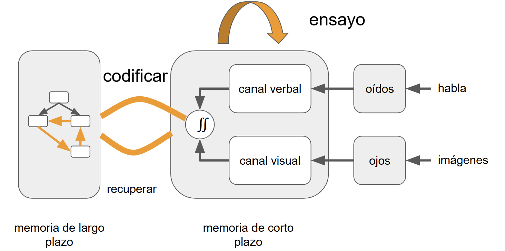

:::::::::::::::::::::::::::::::::::::: questions 

- ¿Qué prácticas ayudan a que el aprendizaje sea significativo?

- ¿Por qué es importante que las personas aprendan haciendo?

- ¿Cómo promovemos la conciencia sobre cómo se aprende?

::::::::::::::::::::::::::::::::::::::::::::::::

::::::::::::::::::::::::::::::::::::: objectives

- Explorar diferentes formas de aprender: pasivas y activas.

- Comprender el papel de la metacognición en el proceso de enseñanza-aprendizaje.

- Incorporar estrategias que favorezcan la práctica y la reflexión.

::::::::::::::::::::::::::::::::::::::::::::::::

## Aprendizaje
### Dos Formas de Aprender

|                         |                          |
|-------------------------|--------------------------|
| Leer algo               | Probar algo              |
| Ver un video            | Hacer ejercicios         |
| Ir a clase              | Discutir un tema         |
| Escuchar una explicación| Intentar explicar un tema|

Hemos estado hablando sobre cómo podemos construir mejores clases, sobre cómo motivar a tus estudiantes y de cómo asegurarnos de incluir a todas y todos. Ahora vamos a cambiar nuestro enfoque y hablaremos sobre cómo brindar esas lecciones y cómo fomentar que el aprendizaje sea más eficiente. 

Vimos al principio de este curso que el aprendizaje es tanto una actividad cognitiva como social. El aprendizaje ocurre cuando nuestro cerebro almacena hechos y procedimientos de manera que le permiten recordar y aplicar lo que necesita cuando lo necesita. También ocurre en un entorno social: se aprende por determinada razón, con otras personas, y tus objetivos, motivaciones y criterios para el éxito se determinan con esas y por esas personas. 

Otra de nuestras ideas clave es que tanto la enseñanza como el aprendizaje deben ser activos: una persona que recita una lección a sus estudiantes que simplemente escuchan es probablemente menos efectiva que una lección donde las personas que asisten participan.

Nuestro punto de partida es el contraste entre dos estilos de enseñanza. Vamos a tomarnos un momento y leer estas dos listas, luego voten en el chat por el estilo que creen que funciona mejor.

| Leer algo                | Probar algo                   |
|--------------------------|-------------------------------|
| Ver un video             | Hacer ejercicios              |
| Ir a clase               | Discutir un tema              |
| Escuchar una explicación | Intentar explicar un tema     |
| **Aprendizaje Pasivo**   | **Aprendizaje Activo**        |

Probablemente no sea sorprendente que los resultados del aprendizaje activo superen a los del aprendizaje pasivo.

### El Aprendizaje Activo Es Mejor

Por ejemplo, este gráfico muestra una reducción en las tasas de fracaso en las clases STEM (de [Active learning increases student performance in science, engineering, and mathematics](http://www.pnas.org/content/111/23/8410.full.pdf)) en un metaanálisis de 225 reportes sobre resultados de exámenes o tasas de desaprobación. En el eje X se presenta el porcentaje de estudiantes que desaprueban. La densidad promedio de estudiantes que desaprueban con aprendizaje por disertación es 33.8%. La densidad de estudiantes que desaprueban con clases de tipo activo es de 21.8%.

::::::::::::::::::::::::::::::::::::: instructor
**mejorar**
(Ojo, sin embargo, los estudiantes informan que prefieren el aprendizaje pasivo, aunque el aprendizaje activo funciona mejor (https://www.pnas.org/content/116/39/19251))
::::::::::::::::::::::::::::::::::::::::::::::::

Tenemos ciencia cognitiva para explicar por qué el aprendizaje activo es mejor.

{alt="Gráfico que muestra que en clases con aprendizaje activo la mayoría de los cursos tienen ≈ 15-25 % de desaprobados, mientras que en clases expositivas la cifra sube a ≈ 30-50 %. En promedio, el enfoque activo reduce la tasa de fracaso del 34 % al 23 %.."}

Volvamos a nuestro modelo simplificado de arquitectura cognitiva para entender por qué. Teníamos dos tipos de memoria, una a corto plazo y otra a largo plazo.

{alt="Diagrama que representa el proceso de codificación de la información en la memoria de corto y largo plazo. A la derecha, los estímulos ingresan a través de los sentidos: los ojos reciben imágenes y los oídos reciben habla. Esta información llega al canal visual y al canal verbal, respectivamente, dentro de la memoria de corto plazo. Ambos canales se integran y pueden ser repetidos mediante ensayo. Desde allí, la información es codificada hacia la memoria de largo plazo, donde se organiza como esquemas. También puede recuperarse desde la memoria de largo plazo hacia la de corto plazo."}

Cuanto más tiempo permanezca algo en la memoria a corto plazo, mayores serán las posibilidades de que se codifique en la memoria a largo plazo. Hace que las personas ensayen información, por lo tanto, ayuda con la retención. 

Del mismo modo, cuanto más práctica tenga la gente para recuperar información, más enlaces se formarán en su modelo mental y más fuertes serán esos enlaces. Hacer que recuerden la información y la usen, por lo tanto, también aumenta el aprendizaje.

## Seis estrategias

Existen seis estrategias que nuestros estudiantes y nosotros podemos usar para aprovechar todo esto, y así aprender más rápido y mejor. El mejor resumen proviene del sitio web de [The Learning Scientists](http://www.learningscientists.org/). 

Las revisaremos una por una:

### Práctica Distribuida

La primera estrategia es la práctica distribuida, o práctica espaciada. Cinco sesiones de estudio de dos horas son más efectivas que dos sesiones de cinco horas, y mucho más efectivas que una sesión apretada de 10 horas. 

Si bien no podemos controlar los hábitos de estudio de nuestros estudiantes, podemos incluir material enseñado previamente en cada clase nueva. 

Del mismo modo y como estudiante, es bueno repasar una clase el mismo día de concluida, pero no inmediatamente después, e incorporar al repaso brevemente los conceptos principales de clases anteriores.

Espaciar las cosas puede ser una de las pocas ventajas de los formatos de clase tradicional sobre el aprendizaje en línea a demanda, porque el riesgo de clases asincrónicas es que nuestros estudiantes recién se expongan al material al final de la cursada.

### Práctica de Recordar lo Aprendido

El factor limitante de la memoria a largo plazo no es retener (qué se almacena) sino recordar (qué puede accederse). Nuestra segunda estrategia tiene que ver con la práctica de recuperación. 

Esto parece obvio: **serás mejor recordando cosas si practicas recordarlas.**

Pero es importante practicar recordar en un contexto realista. Si deseamos recuperar información para una evaluación de opción múltiple, practicaremos haciendo pruebas de opción múltiple; si deseamos recordar las reglas de sintaxis al programar, practicaremos recordarlas mientras programamos.

Una manera de ejercitar las habilidades para recordar es resolver un mismo problema dos veces. La primera vez, completamente de memoria. Tras evaluar nuestro propio trabajo con una rúbrica, resolver el problema de nuevo pero usando material de apoyo, para evaluar qué tan bien pudimos recordar y aplicar lo aprendido.

Otro método es crear tarjetas de estudio. Las tarjetas físicas tienen una pregunta en un lado y la respuesta en el otro, y existen muchas aplicaciones para generarlas disponibles para teléfono móvil. Si estamos estudiando en grupo, intercambiar las tarjetas de estudio con colegas nos ayudará a descubrir ideas importantes que tal vez habíamos obviado o malinterpretado.

- Un método más: leer-cubrir-recordar. Mientras leemos algo, cubrimos términos clave o secciones con notas adhesivas pequeñas. Cuando hayas terminado, volvemos a leer y vemos qué tan bien podemos adivinar las palabras cubiertas.

### Elaboración

La tercera estrategia es la elaboración. 

Sabemos que enseñar algo es una excelente manera de aprenderlo y, en general, autoexplicarse las cosas o explicar a otra persona es una buena manera de fortalecer tu comprensión. 

- Podemos explicar en voz alta un razonamiento. 
::::::::::::::::::::::::::::::::::::: instructor
Quizás escucharon decir que explicarle a un patito de hule cómo funciona un programa, les ayuda a ustedes para comprenderlo
::::::::::::::::::::::::::::::::::::::::::::::::

- Una forma de implementar esto es hacer un seguimiento de cada pregunta en un cuestionario de práctica con una explicación detallada (propia) de por qué esa es la respuesta correcta y por qué otras no lo son. 

- Otra forma es comparar y contrastar información nueva con información vieja.

### Práctica Intercalada

La cuarta estrategia es intercalar los temas de estudio. En vez de dominar un tema, luego el segundo y el tercero, alternamos las sesiones de estudio entre un tema y otro. 

Mezclar el estudio de diferentes temas mejora el recuerdo posterior porque construye más enlaces de largo plazo en nuestro modelo mental.

Aleatorizar el orden es mejor que seguir un patrón repetitivo. Pensemos en la letra de una canción: si siempre la practicamos en el mismo orden, solo podremos recordarla en ese orden.

> A-B-C-A-B-C es mejor que A-A-B-B-C-C
> A-C-B-C-A-B es mejor que A-B-C-A-B-C

### Ejemplos Concretos

La quinta estrategia son los ejemplos concretos. 

Las personas novatas (e incluso las que son competentes) pueden no saber lo suficiente como para poder aplicar un principio general a un caso específico, entonces hay que proveer ejemplos. 

Del mismo modo, cada vez que resolvemos un problema específico, tomemos un momento para describir los principios generales utilizados en su resolución.

Intercalar ejemplos y definiciones ayuda a recordar mejor las definiciones.

### Codificación Dual

La estrategia final es la codificación dual, que discutimos anteriormente. Las imágenes y las palabras son más eficaces en combinación que por sí solas, porque apelan a sistemas de procesamiento cerebrales diferentes. 

Pero hay que tener cuidado al usar palabras e imágenes en simultáneo, porque el cerebro tiene que hacer un esfuerzo extra para interpretarlas.

::::::::::::::::::::::::::::::::::::: challenge 

Elijan una de las seis estrategias de aprendizaje y cuéntenle a su grupo cómo la usarían para aprender un tema.

Práctica distribuida
Práctica de recordar lo aprendido
Elaboración
Práctica intercalada
Ejemplos concretos
Codificación dual

Tiempo para el ejercicio: 10 minutos
Pueden resumirlo en el documento.
::::::::::::::::::::::::::::::::::::::::::::::::

## Resumen

{alt="Mapa conceptual sobre estrategias de aprendizaje y niveles de experiencia. A la izquierda, se listan estrategias de aprendizaje: práctica distribuida, práctica de recordar lo aprendido, práctica intercalada, elaboración, ejemplos concretos y codificación dual, todas incluidas bajo el nodo "estrategias de aprendizaje", que son ayudadas por el "aprendizaje activo". A la derecha, se muestra que el "aprendizaje activo" es mejor que el "aprendizaje pasivo" y forma "conexiones". Las conexiones son un indicador del nivel de experticia: una "persona novata" no tiene conexiones, una "persona competente" tiene pocas, y una "persona experta" tiene muchas."}

::::::::::::::::::::::::::::::::::::: keypoints 

- 

::::::::::::::::::::::::::::::::::::::::::::::::
