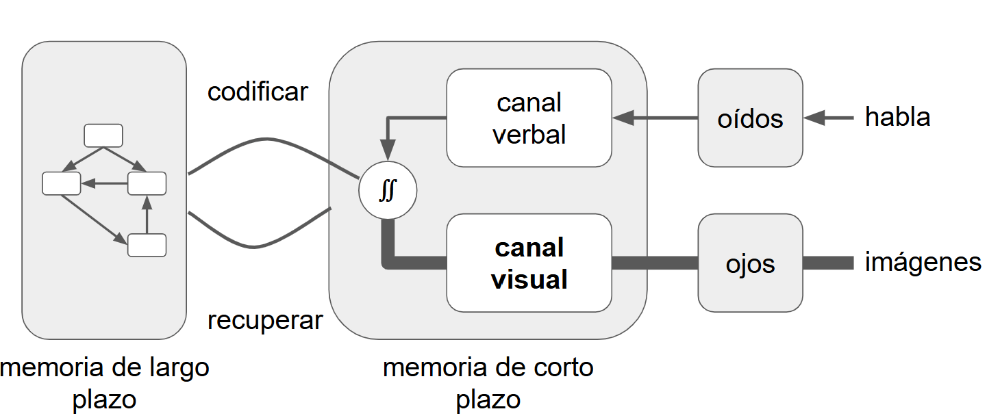

:::::::::::::::::::::::::::::::::::::: questions 

- ¿?

::::::::::::::::::::::::::::::::::::::::::::::::

::::::::::::::::::::::::::::::::::::: objectives

- 

::::::::::::::::::::::::::::::::::::::::::::::::

## Repaso de Mapas Conceptuales

:::::::::::::::::::::::::::::::::::::::::::::::::::::::::::::::::::: instructor

Pregunta para responder por el chat: ¿Les pasó alguna vez estar en una clase en la que vienen entendiendo todo y luego de un rato pierden completamente el hilo y lo que venían entendiendo comienza a desvanecerse y la clase parece convertirse en un blablabla sin sentido? En esta presentación vamos a explorar un poco por qué podría pasar esto, y una posible razón está relacionada con el intervalo 7 más o menos 2. 

::::::::::::::::::::::::::::::::::::::::::::::::::::::::::::::::::::::::::::::::

{alt="La fotosíntesis produce: a) glucosa que guarda energía y b) oxígeno que es liberado al aire; para este proceso requiere CO2 (absorbido del aire), agua y luz. La fotosíntesis ocurre en los cloroplastos que absorben luz."}

Cuando presentamos los mapas conceptuales dijimos que cada nodo/caja y cada relación/flecha cuenta como un ítem para retener en nuestra memoria de corto plazo o memoria de trabajo. También explicamos que la memoria de trabajo puede retener pocos ítems a la vez. En este mapa conceptual hay muchos más elementos de los que la memoria de corto plazo de la mayoría de las personas puede retener.

Una forma de abordar las limitaciones de la memoria de trabajo es dividir el mapa conceptual de contenidos a enseñar en partes, e incluyendo evaluaciones formativas después de cada parte. ¿Pero cómo? ¿Y qué tan grandes deben ser las partes en las que dividimos el mapa conceptual?

Para responder a esa pregunta, volvamos a nuestro diagrama de arquitectura cognitiva y echemos otro vistazo a la memoria a corto plazo. Aprovechemos para repasarlo también.

{alt="Versión completa con énfasis en la vía visual: los canales verbal y visual desembocan en un círculo de integración que luego codifica hacia la memoria de largo plazo. Las flechas provenientes de los ‘ojos’ y hacia el ‘canal visual’, así como la salida de este canal, se dibujan más gruesas para destacar una carga mayor en la ruta visual, mientras la vía auditiva/verbal mantiene líneas finas. Se conservan las rutas de ‘codificar’ y ‘recuperar’ entre la memoria de corto y largo plazo."}

## Siete Más o Menos Dos

Ya en la década de 1950, quienes investigan se dieron cuenta de que la persona promedio solo puede tener en la memoria a corto plazo unos pocos elementos a la vez. Las estimaciones iniciales ponen el número en 7 ± 2; estimaciones más recientes lo ponen tan bajo como 4.

7 mas/menos 2 es una de las razones por las cuales, en la época en que se usaban estos teléfonos y recordábamos los números de memoria, los números de teléfono tienen entre 6 y 8 dígitos. Es difícil mantener más dígitos que eso en la memoria a corto plazo el tiempo suficiente para que el disco gire.

También puede ser la razón por la cual la unidad básica de la organización social humana es media docena de personas. Desde equipos deportivos y formaciones militares, pasando por círculos de tejido hasta reuniones, ese parece ser el límite de la cantidad de personas que pueden estar hablando o trabajando en conjunto al mismo tiempo. Más allá de eso, los grupos más grandes se dividen rápidamente en subgrupos. Si tienes 20 personas en una reunión, tienes tres reuniones en curso o una reunión de media docena de personas con un grupo de personas observando cómo se desarrolla la reunión.

## Cuéntalos Todos

Así que volvamos una vez más a nuestro mapa conceptual de la fotosíntesis. Hay 9 nodos y 7 relaciones etiquetadas (algunas de las cuales son de uno a muchos nodos, pero lo ignoraremos por ahora). Eso hace un total de 16 cosas para que tus estudiantes absorban, y eso te dice que esto es demasiado material para abordar de una vez.

{alt="La fotosíntesis produce: a) glucosa que guarda energía y b) oxígeno que es liberado al aire; para este proceso requiere CO2 (absorbido del aire), agua y luz. La fotosíntesis ocurre en los cloroplastos que absorben luz."}

Una porción factible de recordar puede ser:

"Durante la fotosíntesis se produce glucosa y se guarda como energía"

Otra porción puede ser:

"Durante la fotosíntesis se produce oxígeno que es liberado al aire"

Podemos usar el mapa conceptual para guiar nuestra elección del tamaño del fragmento y también los objetivos secundarios. Esto es un arte: la experiencia nos dictará qué segmentos funcionan mejor.

> Pero, espera un segundo. Si la memoria a corto plazo solo puede contener media docena de cosas a la vez, ¿cómo podemos pensar en cosas más grandes? La respuesta es que si las cosas ocurren frecuentemente juntas, las almacenamos y las recuperamos en pedazos.


::::::::::::::::::::::::::::::::::::: challenge 

## Desafío 1: ¿Podés hacerlo?

¿Cuál es el resultado de este comando?

```r
paste("Esta", "nueva", "lección", "luce", "bien")
```

:::::::::::::::::::::::: solution 

## Salida

```output
[1] "Esta nueva lección luce bien"
```

:::::::::::::::::::::::::::::::::
::::::::::::::::::::::::::::::::::::::::::::::::


::::::::::::::::::::::::::::::::::::: keypoints 

- Usá archivos `.md` para episodios con contenido estático  
- Usá archivos `.Rmd` para episodios que necesiten generar salidas dinámicas  
- Ejecutá `sandpaper::check_lesson()` para identificar problemas en tu lección  
- Ejecutá `sandpaper::build_lesson()` para previsualizar tu lección localmente

::::::::::::::::::::::::::::::::::::::::::::::::
