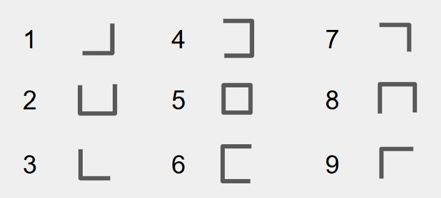

:::::::::::::::::::::::::::::::::::::: questions 

- ¿Qué impacto tiene la sobrecarga cognitiva en la capacidad de aprendizaje?

- ¿Cómo puede un mapa conceptual ayudar a evitar esa sobrecarga?

- ¿Qué técnicas docentes podemos usar para favorecer la comprensión sostenida?

::::::::::::::::::::::::::::::::::::::::::::::::

::::::::::::::::::::::::::::::::::::: objectives

- Reconocer la relación entre la capacidad cognitiva y la carga de información.

- Identificar estrategias para organizar el contenido sin saturar la memoria de trabajo.

- Explorar el uso de mapas conceptuales como apoyo para construir estructuras de conocimiento.

::::::::::::::::::::::::::::::::::::::::::::::::

## Repaso de Mapas Conceptuales

:::::::::::::::::::::::::::::::::::::::::::::::::::::::::::::::::::: instructor

Pregunta para responder por el chat: ¿Les pasó alguna vez estar en una clase en la que vienen entendiendo todo y luego de un rato pierden completamente el hilo y lo que venían entendiendo comienza a desvanecerse y la clase parece convertirse en un blablabla sin sentido? En esta presentación vamos a explorar un poco por qué podría pasar esto, y una posible razón está relacionada con el intervalo 7 más o menos 2. 

::::::::::::::::::::::::::::::::::::::::::::::::::::::::::::::::::::::::::::::::

{alt="La fotosíntesis produce: a) glucosa que guarda energía y b) oxígeno que es liberado al aire; para este proceso requiere CO2 (absorbido del aire), agua y luz. La fotosíntesis ocurre en los cloroplastos que absorben luz."}

Cuando presentamos los mapas conceptuales, dijimos que cada nodo/caja y cada relación/flecha cuenta como un ítem para retener en nuestra memoria de corto plazo o memoria de trabajo. También explicamos que la memoria de trabajo puede retener pocos ítems a la vez. En este mapa conceptual hay muchos más elementos de los que la memoria de corto plazo de la mayoría de las personas puede retener.

Una forma de abordar las limitaciones de la memoria de trabajo es dividir el mapa conceptual de contenidos a enseñar en partes, e incluyendo evaluaciones formativas después de cada parte. ¿Pero cómo? ¿Y qué tan grandes deben ser las partes en las que dividimos el mapa conceptual?

Para responder a esa pregunta, volvamos a nuestro diagrama de arquitectura cognitiva y echemos otro vistazo a la memoria a corto plazo. Aprovechemos para repasarlo también.

{alt="Versión completa con énfasis en la vía visual: los canales verbal y visual desembocan en un círculo de integración que luego codifica hacia la memoria de largo plazo. Las flechas provenientes de los ‘ojos’ y hacia el ‘canal visual’, así como la salida de este canal, se dibujan más gruesas para destacar una carga mayor en la ruta visual, mientras la vía auditiva/verbal mantiene líneas finas. Se conservan las rutas de ‘codificar’ y ‘recuperar’ entre la memoria de corto y largo plazo."}

## Siete Más o Menos Dos

Ya en la década de 1950, se comprobó que la persona promedio solo puede tener en la memoria a corto plazo unos pocos elementos a la vez. Las estimaciones iniciales ponen el número en 7 ± 2; estimaciones más recientes lo ponen tan bajo como 4.

7 más/menos 2 es una de las razones por las cuales, en la época en que se usaban estos teléfonos y recordábamos los números de memoria, los números de teléfono tenían entre 6 y 8 dígitos. Es difícil mantener más dígitos que eso en la memoria a corto plazo el tiempo suficiente para que el disco gire.

También puede ser la razón por la cual la unidad básica de la organización social humana es media docena de personas. Desde equipos deportivos y formaciones militares, pasando por círculos de tejido hasta reuniones, ese parece ser el límite de la cantidad de personas que pueden estar hablando o trabajando en conjunto al mismo tiempo. Más allá de eso, los grupos más grandes se dividen rápidamente en subgrupos. Si tienes 20 personas en una reunión, tienes tres reuniones en curso o una reunión de media docena de personas con un grupo de personas observando cómo se desarrolla la reunión.

## Cuéntalos Todos

Volvamos una vez más a nuestro mapa conceptual de la fotosíntesis. Hay 9 nodos y 7 relaciones etiquetadas (algunas de las cuales son de uno a muchos nodos, pero lo ignoraremos por ahora). Eso hace un total de 16 cosas para que sus estudiantes absorban, y eso nos dice que esto es demasiado material para abordar de una vez.

{alt="La fotosíntesis produce: a) glucosa que guarda energía y b) oxígeno que es liberado al aire; para este proceso requiere CO2 (absorbido del aire), agua y luz. La fotosíntesis ocurre en los cloroplastos que absorben luz."}

Una porción factible de recordar puede ser:

"Durante la fotosíntesis se produce glucosa y se guarda como energía"

Otra porción puede ser:

"Durante la fotosíntesis se produce oxígeno que es liberado al aire"

Podemos usar el mapa conceptual para guiar nuestra elección del tamaño del fragmento y también los objetivos secundarios. Esto es un arte: la experiencia nos dictará qué segmentos funcionan mejor.

> Pero, si la memoria a corto plazo solo puede contener media docena de cosas a la vez, ¿cómo podemos pensar en cosas más grandes? La respuesta es que si las cosas ocurren frecuentemente juntas, las almacenamos y las recuperamos en pedazos.

::::::::::::::::::::::::::::::::::::: challenge 

## Ejercicio

**Es puramente visual**

En la próxima pantalla vamos a mostrar por 30 segundos los números del 1 al 9 asociados a un símbolo.

Usemos los 30 segundos para memorizar los símbolos.

{alt="Nueve formas angulares en una cuadrícula de 3x3. Cada celda contiene una figura compuesta por líneas en forma de esquina. En la fila del medio, la figura central (posición 5) es un cuadrado completo. Las demás figuras son esquinas con una o más líneas faltantes. Las posiciones están numeradas del 1 al 9, de izquierda a derecha y de arriba hacia abajo."}

Tienen 30 segundos para escribir sus números de teléfono usando los símbolos.

Pregunta para responder por el chat, ¿cuántos dígitos pudieron escribir usando el código?

Decíamos entonces que para pensar en cosas grandes, y que frecuentemente ocurren juntas, es más fácil si las almacenamos y las recuperamos en pedazos. Así que intentemos nuevamente el ejercicio.

{alt="Cuadrícula de 3 filas por 3 columnas con líneas negras gruesas, formando nueve celdas numeradas del 1 al 9. Los números están ubicados en el centro de cada celda, siguiendo el orden de izquierda a derecha y de arriba hacia abajo: 1 a 3 en la primera fila, 4 a 6 en la segunda, y 7 a 9 en la tercera."}

Esto es más fácil, ¿no? Nuestros cerebros son muy buenos para ver patrones. Tan buenos, de hecho, que verán patrones que no existen (¡como las caras en las nubes!).
Como docentes, podemos usar esto para reducir la carga cognitiva y acelerar el aprendizaje.

::::::::::::::::::::::::::::::::::::::::::::::::

## Ejemplos Desvanecidos

Al aprender una habilidad técnica, como programar o trabajar con datos, es habitual comenzar observando ejemplos completamente resueltos. Estos ejemplos ayudan a entender cómo se estructura una solución y qué pasos seguir. Pero si siempre estudiamos ejemplos ya resueltos, no desarrollamos las habilidades necesarias para resolver por cuenta propia los desafíos que se presentan en la práctica.

Por eso, existe una estrategia pedagógica llamada ejemplos desvanecidos. Esta consiste en presentar una serie de ejercicios que, al principio, muestran todos los pasos necesarios para resolver un problema, pero que progresivamente van omitiendo partes de la solución. Así, se invita a quienes aprenden a completar esos pasos por sí mismos, reflexionando sobre lo que hacen y por qué lo hacen. Esto promueve una práctica llamada autoexplicación, que fortalece la comprensión y la autonomía.

### Ejemplo

Primero, el instructor resuelve un problema paso a paso.

(4x + 8)/2	=	5
4x + 8	=	2 * 5
4x + 8	=	10
  	4x	=	10 - 8
  	4x	=	2
   	  x	=	2/4
   	  x	= 	1/2

Luego, se le pide al **grupo control** que resuelva este problema de inmediato. Deben recordar tanto el vocabulario de la aritmética básica como la "gramática" de la estrategia de solución.

(2x + 8)/4	=	1
     x	    =	__

A continuación, el **grupo con intervención** resuelve tres problemas diferentes, en orden. Cada uno de los problemas, presentados en este orden, resta andamios. Esto significa que como hay menos ayuda, hay que hacer más trabajo, pero así se refuerza su comprensión de la estrategia de resolución. El grupo con la intervención trabaja más, pero aprende más rápido y mejor.

| Ejercicio 1                          | Ejercicio 2                   | Ejercicio 3                  |
|-------------------------------------|-------------------------------|------------------------------|
| (3x - 1) * 3   =  12                | (5x + 1) * 3   =  4           | (2x + 8)/4   =   1           |
| 3x - 1       =  __ / __            | 5x + 1       =  __           | x           =   __          |
| 3x - 1       =  4                  | 5x           =  __           | x           =   __ / 3      |
| 3x           =  __ + __            | x            =  __           | x           =   __          |
| 3x           =  __                |                               |                              |

:::::::::::::::::::::::::::::::::::::::::::::::::::::::::::::::::::: instructor

Respecto de lo que hablamos en la unidad de carga cognitiva: ¿cómo les parece que ayudan este tipo de ejercicios?

::::::::::::::::::::::::::::::::::::::::::::::::::::::::::::::::::::::::::::::::

En parte, se debe a que los ejemplos desvanecidos reducen la carga cognitiva pertinente al permitirles centrarse en los pasos sin tratar simultáneamente de tener que elegir una estrategia.

Los ejemplos desvanecidos también alientan a tus estudiantes a formar los fragmentos correctos al llamar su atención sobre patrones útiles.

::::::::::::::::::::::::::::::::::::: challenge 

## Ejercicio

1. Escriban un procedimiento de 4 a 5 pasos cortos de algo que podrías enseñar.

2. Reemplacen 2 a 3 elementos con ______

3. Expliquen: ¿A qué estamos llamando la atención en su elección de qué se desvanece?

::::::::::::::::::::::::::::::::::::::::::::::::::::::::::::::::::::::::::::::::

:::::::::::::::::::::::::::::::::::::::::::::::::::::::::::::::::::: instructor

###Pausa

No se desconecten, pero sí aléjense de pantallas.

Volvemos en 10 minutos.

::::::::::::::::::::::::::::::::::::::::::::::::::::::::::::::::::::::::::::::::

{alt="Diagrama de flujo que muestra cómo los mapas conceptuales ayudan a diseñar lecciones que deben ajustarse a la capacidad limitada de la memoria de corto plazo. Esta capacidad puede incrementarse mediante la fragmentación, lo cual reduce la carga cognitiva. El pensamiento accede a la memoria de corto plazo, la cual a su vez codifica y recupera información desde la memoria de largo plazo. Esta memoria de largo plazo guarda modelos mentales, que son representados en mapas conceptuales. El pensamiento está limitado por la carga cognitiva, que se construye en este proceso general de aprendizaje y diseño instruccional."}

::::::::::::::::::::::::::::::::::::: keypoints 

- 

::::::::::::::::::::::::::::::::::::::::::::::::
