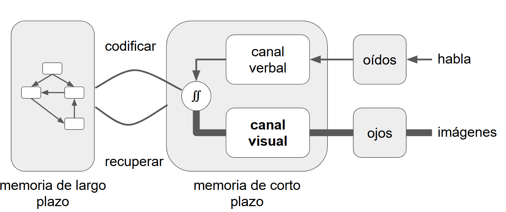

:::::::::::::::::::::::::::::::::::::: questions 

- ¿Qué es la carga cognitiva y cómo afecta el aprendizaje?

- ¿Cómo podemos diseñar la instrucción para trabajar con, en lugar de contra, las limitaciones de la memoria?

::::::::::::::::::::::::::::::::::::::::::::::::

::::::::::::::::::::::::::::::::::::: objectives

- Recordar el límite cuantitativo de la memoria humana.
- Distinguir la carga cognitiva deseable de la indeseable.
- Evaluar la carga cognitiva asociada a una tarea de aprendizaje.

::::::::::::::::::::::::::::::::::::::::::::::::

## ¿Qué Está Pasando Ahí Adentro?

Hemos estado hablando de modelos mentales como si fueran cosas reales, pero ¿qué sucede realmente en el cerebro de nuestra audiencia cuando está aprendiendo? La respuesta corta es que no lo sabemos; la respuesta más larga es que sabemos mucho más de lo que solíamos y tenemos algunos modelos bastante buenos que pueden ayudarnos a diseñar y brindar lecciones de manera más efectiva.

{alt="esquema que presenta dos recuadros principales, uno llamado "memoria de largo plazo" y otro "memoria de corto plazo". El recuadro "memoria de largo plazo" contiene un modelo mental de cajas y flechas que se relacionan entre sí. En el recuadro "memoria de corto plazo", hay una caja representando al canal visual y otra caja representando al canal verbal. Desde ambas cajas salen una flecha hacia un signo de integración doble desde el cual sale una relación llamada "codificar" hacia la memoria de largo plazo. Desde la memoria de largo plazo sale una relación llamada "recuperar" hacia la memoria de corto plazo. Las imágenes tomadas a partir de los ojos y el habla registrada por medio de los oídos están por fuera de los dos recuadros principales y se relacionan con los canales visuales y verbales de la memoria a corto plazo, respectivamente."}

Este es un modelo simplificado de arquitectura cognitiva humana. Están pasando muchas cosas aquí, así que vamos a estudiarlas por partes.

## Dos Formas de Memoria

{alt="Esquema inicial de la arquitectura cognitiva: a la izquierda, un rectángulo gris rotulado ‘memoria de largo plazo’ contiene varios nodos blancos enlazados entre sí; a la derecha, un rectángulo vacío (sin contenido) representa la ‘memoria de corto plazo’. No hay flechas entre ambos módulos."}

El núcleo de este modelo es que tenemos dos tipos de memoria. La memoria a largo plazo sería el sótano, o la baulera: almacena (muchas) cosas de forma más o menos permanente, pero nuestra conciencia no puede acceder a ella directamente. Por ejemplo, los recuerdos de un cumpleaños de segundo grado, nuestro número de teléfono. En cambio, confiamos en nuestra memoria a corto plazo, o memoria de trabajo, que es el escritorio y nos permite acceder a esas cosas rápidamente.

{alt="Se añaden dos flechas curvas que conectan los mismos bloques: la superior, etiquetada ‘codificar’, va de la memoria de corto plazo a la de largo plazo; la inferior, etiquetada ‘recuperar’, va en sentido inverso. Ilustra el flujo bidireccional de información entre ambos sistemas de memoria."}

Cuando necesitamos algo, nuestro cerebro lo recupera de la memoria a largo plazo y lo guarda en la memoria a corto plazo. La nueva información que llega a la memoria a corto plazo debe codificarse para almacenarse en la memoria a largo plazo. Si esa información no está codificada y almacenada, no se recuerda y no se ha aprendido.

{alt="Sobre la memoria de corto plazo se muestran ahora dos submódulos: ‘canal verbal’ (arriba) y ‘canal visual’ (abajo). Cada uno recibe entrada de un bloque sensorial: los ‘oídos’ para la ‘habla’ y los ‘ojos’ para las ‘imágenes’. Las flechas sensoriales apuntan hacia los canales, que siguen conectados con la memoria de largo plazo mediante las rutas de ‘codificar’ y ‘recuperar’."}

La información ingresa a la memoria a corto plazo principalmente a través de su canal verbal (para el habla) y el canal visual (para las imágenes). Un modelo más completo también incluiría el sentido del tacto y la capacidad para oler y saborear cosas, pero las ignoraremos por ahora.

{alt="esquema que presenta dos recuadros principales, uno llamado "memoria de largo plazo" y otro "memoria de corto plazo". El recuadro "memoria de largo plazo" contiene un modelo mental de cajas y flechas que se relacionan entre sí. En el recuadro "memoria de corto plazo", hay una caja representando al canal visual y otra caja representando al canal verbal. Desde ambas cajas salen una flecha hacia un signo de integración doble desde el cual sale una relación llamada "codificar" hacia la memoria de largo plazo. Desde la memoria de largo plazo sale una relación llamada "recuperar" hacia la memoria de corto plazo. Las imágenes tomadas a partir de los ojos y el habla registrada por medio de los oídos están por fuera de los dos recuadros principales y se relacionan con los canales visuales y verbales de la memoria a corto plazo, respectivamente."}

La última parte de esta imagen es el trabajo que hace nuestro cerebro para integrar la información que recibe a través de diferentes canales. Si escuchamos y vemos cosas al mismo tiempo, nuestro cerebro trata de integrarlas correlacionándolas y almacenándolas juntas. Como veremos en unos momentos, eso puede ayudar o perjudicar el aprendizaje.

{alt="Versión completa con énfasis en la vía visual: los canales verbal y visual desembocan en un círculo de integración que luego codifica hacia la memoria de largo plazo. Las flechas provenientes de los ‘ojos’ y hacia el ‘canal visual’, así como la salida de este canal, se dibujan más gruesas para destacar una carga mayor en la ruta visual, mientras la vía auditiva/verbal mantiene líneas finas. Se conservan las rutas de ‘codificar’ y ‘recuperar’ entre la memoria de corto y largo plazo."}

Como lo hemos dibujado hasta ahora, este diagrama da igual peso a los canales verbales y visuales. En realidad, la mayoría de las personas obtienen mucha más información, mucho más rápidamente, a través de su canal visual.

::::::::::::::::::::::::::::::::::::: challenge 

## Pregunta para contestar en el chat:

¿Qué porcentaje de la información que recibimos consideran que ingresa por cada uno de los cinco sentidos?

:::::::::::::::::::::::::::::::::

## Pesos Desiguales

Obviamente, hay mucha variabilidad entre las personas, y nuestras personas tipo deberían recordarnos que no todos pueden ver y escuchar por igual, pero las siguientes cifras dan una idea de cuánta información obtenemos de diferentes sentidos y cuánto de nuestro cerebro está dedicado a procesarlo y almacenarlo. Lo que esto nos dice es que, en la mayoría de los casos, nuestras lecciones deben ser lo más visuales posible.

| Sentido   | Información | Neuronas |
|-----------|-------------|----------|
| Visión    | 83 %        | 30 %     |
| Audición  | 11 %        | 2 %      |
| Olfato    | 3.5 %       | —        |
| Tacto     | 1.5 %       | 8 %      |
| Gusto     | 1 %         | —        |

Pero eso no significa que solo debamos usar imágenes. Los estudios han demostrado que cuando las imágenes y las palabras se complementan, el cerebro hace un mejor trabajo al recordarlas a ambas. La teoría es que están codificados juntos, de modo que más tarde, el recuerdo de uno ayuda a activar el recuerdo del otro.

## Leer Es Raro

Este modelo también explica por qué es menos efectivo presentar la misma información como texto y habla, como leer en voz alta una presentación con mucho texto, o con subtítulos que "digan" lo mismo que quien presenta. El texto entra por el canal visual, pero luego se desvía al canal verbal. Nuestro cerebro no puede evitar intentar conciliar los dos canales que está recibiendo (una a través de los ojos y la otra a través de los oídos). Correlacionar flujos de información lingüísticos y visuales requiere un esfuerzo mental: si alguien lee algo mientras lo escucha en voz alta, su cerebro no puede evitar comprobar que obtiene la misma información por ambos canales. Al hacerlo, disminuye la capacidad de hacer un esfuerzo mental para codificar la información y así almacenarla.

Por lo tanto, el aprendizaje aumenta cuando la información se presenta de manera simultánea por dos canales diferentes, pero se reduce cuando esa información es redundante, en lugar de ser complementaria: tal fenómeno es conocido como efecto de atención dividida [Maye2003]

Tres escenarios: 
1) Habla e imágenes: se integran bien. 
2) Texto e imágenes: requieren un esfuerzo extra para convertir el texto al canal verbal, pero funcionan. 
3) Habla, texto e imágenes: demanda el mayor esfuerzo extra (a menos que no hables el idioma, entonces el texto -subtítulos- ayuda).

:::::::::::::::::::::::::::::::::::::::::::::::::::::::::::::::::::: instructor

###Pausa

No se desconecten, pero sí aléjense de pantallas.

Volvemos en 10 minutos.

::::::::::::::::::::::::::::::::::::::::::::::::::::::::::::::::::::::::::::::::

## Carga Cognitiva

El concepto de "esfuerzo mental" resulta ser uno de los más importantes en educación. El término técnico es carga cognitiva, y aunque el modelo continúa evolucionando, existen básicamente tres tipos.

Para explicar las diferencias, imaginemos que están aprendiendo a hablar francés y que se les ha pedido que traduzcan esta oración:

> ¿Cómo está tu rodilla?

:::::::::::::::::::::::::::::::::::::::::::::::::::::::::::::::::::: instructor

Pregunta para responder por el chat: ¿Quiénes de ustedes hablan francés?

::::::::::::::::::::::::::::::::::::::::::::::::::::::::::::::::::::::::::::::::

Supongamos que les damos las palabras que necesitan. Tienen que hacer dos cosas: recordar algunas palabras y organizarlas gramaticalmente, de modo que todo lo que tienen que hacer es organizarlas en el orden correcto.

> genou
> comment
> ton
> va

Hicimos el problema mucho más simple dándoles el vocabulario y permitiéndoles enfocar su atención en la gramática.

> comment va ton genou

:::::::::::::::::::::::::::::::::::::::::::::::::::::::::::::::::::: instructor

(Este tipo de ejercicios hace Duolingo… ellos saben de educación!)

::::::::::::::::::::::::::::::::::::::::::::::::::::::::::::::::::::::::::::::::

**En general, la carga intrínseca es de lo que se trata la tarea de aprendizaje. La carga pertinente es un trabajo adicional relevante, como recordar palabras o elegir una estrategia de prueba. La carga extrínseca es irrelevante.** [Mejorar esta parte]

**Propuesta**
La carga cognitiva intrínseca es la que viene con el contenido que queremos enseñar. Es lo esencial de la tarea: por ejemplo, entender un concepto nuevo o seguir una receta.

La carga cognitiva pertinente es el esfuerzo adicional que ayuda a aprender mejor. Incluye cosas como elegir una estrategia, hacer conexiones o recordar pasos importantes.

La carga cognitiva extrínseca es todo lo que distrae o dificulta el aprendizaje sin aportar valor. Puede venir de instrucciones poco claras, desorden en los materiales o barreras de acceso.

::::::::::::::::::::::::::::::::::::: challenge 

## Ejercicio: Tipos de carga

En el documento compartido, decidan qué tipo de carga es cada uno de los siguientes aspectos del ejercicio anterior (“Cómo está tu rodilla” en francés). 

- Orden de las palabras
- Vocabulario 
- Tipografía

Agreguen al lado de cada aspecto una I si es Intrínseca, una P si es Pertinente o una E si es Extrínseca.

:::::::::::::::::::::::: solution 

## Solución

- Orden de las palabras (I)
- Vocabulario (P)
- Tipografía (E)

En este caso, la **carga intrínseca** es determinar el orden de las palabras. La **carga pertinente** es recordar las palabras; esta carga se puede reducir presentándote las palabras. Y la **carga extrínseca** puede ser el uso de una fuente diferente para cada palabra: llama la atención, pero no agrega nada a la lección. De hecho, hace más difícil el ejercicio porque nuestro cerebro está constantemente identificando las diferencias e intentando encontrar una razón de por qué cada palabra tiene distinta tipografía.

:::::::::::::::::::::::::::::::::
:::::::::::::::::::::::::::::::::

:::::::::::::::::::::::::::::::::::::::::::::::::::::::::::::::::::: instructor
Moraleja: evitemos la carga extrínseca cuando enseñemos.
::::::::::::::::::::::::::::::::::::::::::::::::::::::::::::::::::::::::::::::::

## Una Cosa a la Vez

Se trata de reducir la complejidad de lo que se espera que una persona aprenda en simultáneo. En lugar de incorporar múltiples habilidades al mismo tiempo, se propone descomponer los procesos en partes más simples y trabajarlas por separado, permitiendo que cada una se afiance antes de pasar a la siguiente.

La teoría de la carga cognitiva explica por qué la orientación mínima durante la instrucción no funciona. Es decir, por qué dejar a las personas resolver problemas "reales" desde el primer día es menos efectivo que enseñar explícitamente las habilidades de los componentes necesarios para resolver el problema una a una. La razón es que combinar dos cosas es una habilidad separada en sí misma. Si quieres aprender a cantar mientras tocas el piano, debes aprender a tocar, aprender a cantar y luego aprender a combinar los dos. Una vez que se haya dominado la habilidad combinada, es posible hacer las dos cosas juntas desde el principio.

:::::::::::::::::::::::::::::::::::::::::::::::::::::::::::::::::::: instructor
Responder en el chat: ¿Conocen Scratch? Scratch es un lenguaje de programación visual y organizado en bloques modulares. 

Cada bloque tiene una función diferente. Al combinar bloques, como si combináramos piezas de Lego, se van generando acciones más complejas, o algoritmos, en definitiva, se crea un programa. Así, podemos ayudar a aprender a programar y desarrollar habilidades mentales, sin tener conocimientos avanzados sobre la sintaxis del código.
::::::::::::::::::::::::::::::::::::::::::::::::::::::::::::::::::::::::::::::::

La teoría de la carga cognitiva también explica por qué las herramientas basadas en bloques como Scratch son tan efectivas. Al eliminar la posibilidad de errores de sintaxis, permiten a las personas novatas centrarse en la semántica de sus programas.

## Problemas de Parsons

¿Cómo aplicamos esto de “una cosa a la vez” en la enseñanza? 

Los problemas en los que sus estudiantes reciben piezas que tienen que reorganizar se denominan problemas de Parsons, y se ha demostrado que son más efectivos en las primeras etapas del aprendizaje de la programación que escribir código desde cero. Artículo en inglés: Resolver ejercicios Parsons frente a corregir y escribir código, en inglés: [Solving parsons problems versus fixing and writing code](https://dl.acm.org/doi/10.1145/3141880.3141895)

::::::::::::::::::::::::::::::::::::: challenge 

## Ejemplo: Suma todos los números positivos en una lista

1)	para cada número en la lista
2)	total = total + número
3)	termina el ciclo
4)	si número > 0
5)	termina la condición
6)	total = 0

:::::::::::::::::::::::: solution 

## Solución: Suma todos los números positivos en una lista

6)	total = 0
1)	para cada número en la lista
4)	si número > 0
2)	total = total + número
5)	termina la condición
3)	termina el ciclo
:::::::::::::::::::::::::::::::::
:::::::::::::::::::::::::::::::::

::::::::::::::::::::::::::::::::: callout

¡Atención! Un buen problema de Parsons tiene solo un ordenamiento correcto y los pasos para realizar una tarea están segmentados en etapas cortas. En caso contrario, pueden ser muy difíciles de resolver, con muchas alternativas o saltos entre etapas muy genéricos.

Aprovechemos los problemas de Parsons. Son rápidos, fáciles de construir y efectivos. Pueden crearlos sus estudiantes y ¡resolverlos entre ellos!

:::::::::::::::::::::::::::::::::

::::::::::::::::::::::::::::::::::::: challenge 

## Ejercicio: Creen un problema de Parsons con una receta de comida o bebida que les guste.

El o la colega que sigue en el documento compartido lo resuelve.

Quien lo creó, chequea que el resultado sea correcto y da una devolución usando un comentario.

:::::::::::::::::::::::: 

::::::::::::::::::::::::::::::::::::: keypoints 

- La memoria a largo plazo es nuestro sótano, o la baulera: almacena (muchas) cosas de forma más o menos permanente, pero nuestra conciencia no puede acceder a ella directamente.
- La nueva información que llega a la memoria a corto plazo debe codificarse para almacenarse en la memoria a largo plazo.
- Si escuchamos y vemos cosas al mismo tiempo, nuestro cerebro trata de integrarlas correlacionándolas y almacenándolas juntas. 
- Resolver problemas "reales" desde el primer día es menos efectivo que enseñar explícitamente las habilidades de los componentes necesarios para resolver el problema una a una.
::::::::::::::::::::::::::::::::::::::::::::::::
