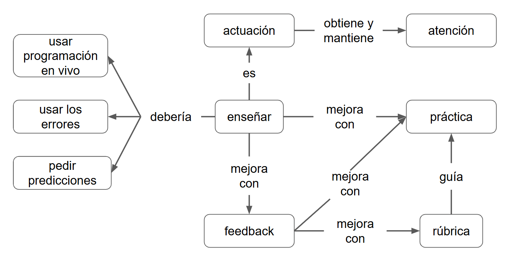

:::::::::::::::::::::::::::::::::::::: questions 

- ¿Por qué es clave recibir y dar retroalimentación al enseñar?

- ¿Cómo podemos desarrollar una cultura de revisión entre pares?

- ¿Qué podemos aprender de otras tradiciones educativas sobre la crítica docente?

::::::::::::::::::::::::::::::::::::::::::::::::

::::::::::::::::::::::::::::::::::::: objectives

- Entender la importancia de la crítica constructiva para la mejora docente.

- Reflexionar sobre el valor del feedback como herramienta profesional.

- Explorar prácticas culturales como el jugyokenkyu para el desarrollo docente colaborativo.

::::::::::::::::::::::::::::::::::::::::::::::::

## Crítica - feedback
### La Enseñanza como Actuación

Cuando enseñamos, nos convertimos en actrices y actores. El objetivo principal es atraer la atención de la audiencia y convencerla de que vale la pena escuchar lo que estamos diciendo. Al hacer eso, existe la posibilidad de que aprendan; al no hacerlo, podrían leer un libro en lugar de estar en nuestra clase. 

Tenemos dos buenas noticias:

La primera es que **no se nace siendo buen docente**, se aprende, se practica y se mejora. 

Hay un estudio muy interesante que compara el sistema japonés jugyokenkuy para formar docentes con otros sistemas educativos occidentales. Entre otras cosas, notaron que en Japón las personas que hacen docencia se reúnen al menos una vez por semana para discutir ideas sobre cómo enseñar, mientras que en Estados Unidos lo hacen como mucho una vez al año. Y pasa en muchísimos países, lo que pasa en el aula queda en el aula. No se comparten materiales, nadie observa cómo enseña un colega y como resultado terminan inventando la rueda una y otra vez.

La otra buena noticia es que no es necesario descubrir con enseñar desde cero, sabemos un montón sobre qué funciona y qué no (alguna parte de lo que estamos aprendiendo acá).

#### Paso 1: Consigue Crítica

Entonces, ¿cómo podemos mejorar nuestra enseñanza? En el paso 1, recibimos comentarios sobre lo que estamos haciendo de alguien más.

Estuvo muy bueno cómo usaste x para explicar y. Tal vez para explicar z podés...

#### Paso 2: Ofrece Crítica sobre la Crítica

En el paso 2, realizamos comentarios y recibimos comentarios sobre esos comentarios.

Gracias por los comentarios, esto que me dijiste me sirvió porque "x", esto otro no me ayudó porque "y".

#### Paso 3: Autocrítica

El paso 3 es donde sucede la magia. Una vez que sabemos cómo criticar, podemos autocriticarnos mientras trabajamos. En términos musicales, estamos escuchando nuestra propia música mientras la tocamos. Ese ciclo de retroalimentación es tan estrecho y tan gratificante que nuestra habilidad despega de inmediato.

## Crítica Constructiva

- **Pidan feedback**. La mayoría de las personas no lo ofrece abiertamente.
- Ser **específico/a**.
- **Balancear** lo positivo y lo negativo. 
- Ofrecer un **próximo paso** a seguir.
- Definir y comunicar las **expectativas**.
- Dar feedback es una **habilidad que se practica**.

### Recibir críticas puede ser duro

A veces somos muy exigentes con nosotros mismos, a veces nos quedamos solo con ese comentario negativo. Tener un colega que nos ayude a analizar y “traducir” los comentarios puede ayudarnos. También es útil pedirle a esa persona que haga un resumen, puede ser más llevadero escuchar “parece que la mayoría piensa que podrías ir un poco más rápido” que leer 10 comentarios que dicen “la clase es muy lenta”, “me aburro”. 

::::::::::::::::::::::::::::::::::::: challenge 

## Ejercicio 1

¿Qué cosas hace mal la docente en el siguiente video?

¿Cuál es la peor de todas?

¿Cómo se puede dar crítica constructiva en una situación así?

[Enseñando muy mal](http://tiny.cc/MetaDocenciaEnsenarMalPro)

::::::::::::::::::::::::::::::::::::::::::::::::

## Una Rúbrica Simple

| Positivo | Negativo |              |
|----------|----------|--------------|
|          |          | Contenido    |
|          |          | Interacción  |
|          |          | Presentación |

Esta rúbrica de 3x2 es una forma sencilla de dar devoluciones sobre la enseñanza de alguien. Separa lo positivo de lo negativo y el contenido (lo que se dice) de la presentación (cómo se dice) y del nivel de interacción con la audiencia. No siempre está claro en qué categoría entra cada cosa, pero ayuda a organizar y comparar comentarios.

::::::::::::::::::::::::::::::::::::: challenge 

## Ejercicio 2

Dar feedback sobre el siguiente video en la siguiente diapositiva usando la rúbrica 3x2.

[Enseñando mejor](http://tiny.cc/MetaDocenciaEnsenarBienPr)

::::::::::::::::::::::::::::::::::::::::::::::::

:::::::::::::::::::::::::::::::::::::::::::::::::::::::::::::::::::: instructor

### Pregunta para contestar en el chat

Piensen nuevamente en el video anterior, enfocándose en lo que la docente mejoró en el último video en comparación con el primero que vieron.

::::::::::::::::::::::::::::::::::::::::::::::::::::::::::::::::::::::::::::::::

## Programación en Vivo

No siempre es necesario usar presentaciones (slides, PPT) en nuestras clases; muchas veces es mejor no hacerlo. Por ejemplo, cuando programamos en vivo recorremos la clase a la par de los estudiantes, escribiendo código y explicando en el camino. Además, si los estudiantes escriben el código y resuelven los ejercicios en paralelo, la programación en vivo es interactiva. 

En los videos anteriores vimos un ejemplo de a qué nos referimos con programación en vivo. 

Hablamos de enseñar a programar, pero esta estrategia es aplicable a otras áreas, por ejemplo, en matemáticas naturalmente los docentes resuelven ejercicios en conjunto con los estudiantes, o en una clase de inglés donde muchas veces los ejercicios son resueltos entre todos.

::::::::::::::::::::::::::::::::::::: challenge 

## Ejercicio

Mencionen ventajas y desventajas de la programación en vivo:

- Desde el punto de vista del docente
- Desde el punto de vista de la audiencia

::::::::::::::::::::::::::::::::::::::::::::::::

## Consejos

> Cada función o comando que escribamos o clic que hagamos en un menú o botón, digámoslo en voz alta a medida que lo hacemos. Si es la primera vez que lo explicamos, resaltemos lo escrito y volvamos a repasarlo. Esto ayuda a ir despacio y le permite a nuestros estudiantes copiar lo que está sucediendo en la pantalla. ¡Es importante no copiar y pegar código!

> Intentemos usar las mismas herramientas que nuestros estudiantes y que tengan la misma experiencia. Los temas oscuros en R o python pueden ser muy lindos pero dificultan ver el código y además aumentan la carga cognitiva

> Tengamos en cuenta la accesibilidad. Usemos una fuente grande, colores con mucho contraste y preferentemente letras negras sobre fondo blanco. Si estamos dando clases presenciales y proyectando pantalla, tengamos en cuenta que las personas del fondo también tienen que poder ver lo que estamos haciendo. 

> Usemos dibujos y diagramas para ayudar a nuestros estudiantes a organizar y entender los conceptos. Siempre es mejor empezar con diagramas simples e irlos construyendo con ellos a medida que se van viendo los conceptos. Esto les ayuda a generar las conexiones necesarias entre las ideas.

> Apaguemos las notificaciones. Tanto en entornos virtuales como presenciales.

> Aprendamos la canción pero luego improvisemos sobre ella. Sobre todo si es la primera vez que damos una clase, aprovechemos nuestros puntos fuertes y el material que ya existe (por ejemplo, lecciones abiertas ya creadas). Usemos notas, sean clases virtuales o presenciales, ayudan a disminuir la carga cognitiva docente.

Aprovechemos los errores cometidos durante la clase, explicar cómo se resuelven hace que la audiencia también aprenda esa habilidad. Si al llegar a la mitad de la clase y no cometimos ningún error, hagámoslo a propósito!

> Cuidado con perder estudiantes en el camino, cada tanto es necesario chequear que nuestra audiencia nos siga. Podemos usar post-its!

## Más feedback

Practicamos mucho dar y recibir feedback entre colegas, también mencionamos pedir feedback a nuestros estudiantes. Estas son algunas ideas para hacerlo.

- Usar notas adhesivas de colores para identificar cuando terminaron un ejercicio y cuando tienen problemas. 

- Esas notas adhesivas también pueden servir para dejar comentarios anónimos al final de la jornada. Por ejemplo, en el verde escribir algo importante que aprendieron hoy, en el rojo algo que resultó confuso y habría que revisar. 

- Pedir feedback en vivo al final de la clase, que cada persona por turno mencione algo positivo (pulgar para arriba) o negativo (pulgar para abajo) según le toque. La regla es que no pueden repetir comentarios, eso les obligará a pensar más y no caer en los comentarios más amigables y seguros. Lo importante es no comentar sobre el feedback en el momento, agradecerlo y dar tiempo a procesarlo antes de responder o cambiar nada en tu clase.

- Formulario de fin de clase. Puede ser tan sencillo como el que usamos en MetaDocencia, algo para mantener, algo para mejorar. Anónima y cortita. La clave está en dedicar los últimos minutos de la clase a que respondan el formulario, de esa manera habrá más chances de que todo el mundo lo complete. 

::::::::::::::::::::::::::::::::::::: challenge 

## Ejercicio

Ahora es turno de ustedes. Expliquen el tema que elijan en su grupo, hablando durante 2 o 3 minutos. ¡Tienen que usar cronómetro! Mientras tanto, alguien del grupo toma notas sobre la rúbrica 3x2 (hacer una copia debajo de sus nombres). Cuando hayan terminado, intercambien roles y luego compartan sus comentarios con todo el grupo. Todas las personas del grupo deben explicar antes de compartir el feedback.

::::::::::::::::::::::::::::::::::::::::::::::::

{alt="Diagrama que representa estrategias para mejorar la enseñanza. En el centro, el nodo "enseñar" se describe como una "actuación", que debería incorporar: pedir predicciones, usar los errores y usar programación en vivo. Enseñar mejora con "feedback", el cual a su vez mejora con "práctica", "rúbrica" y "guía". La práctica también se potencia con el feedback. La actuación obtiene y mantiene la "atención"."}

:::::::::::::::::::::::::::::::::::::::::::::::::::::::::::::::::::: instructor
## Tarea para el próximo encuentro

Repasen el feedback que les dieron, lo van a necesitar para el próximo encuentro.

**DEFINIR CHECKOUT**
**Comiencen a leer la lección entera, lo van a necesitar para el checkout.**
::::::::::::::::::::::::::::::::::::::::::::::::::::::::::::::::::::::::::::::::

::::::::::::::::::::::::::::::::::::: keypoints 

- 

::::::::::::::::::::::::::::::::::::::::::::::::
