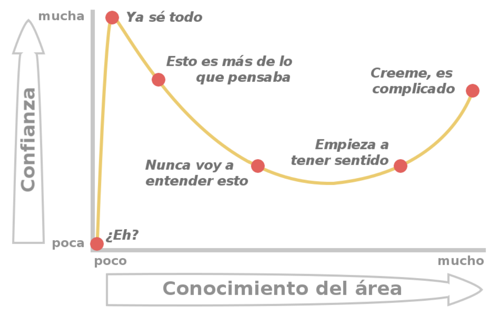
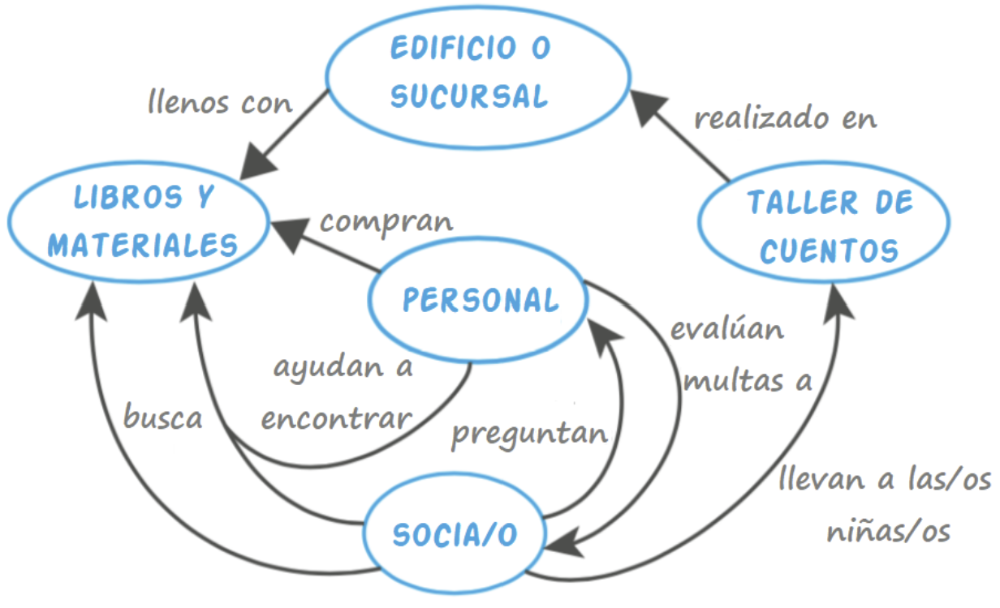
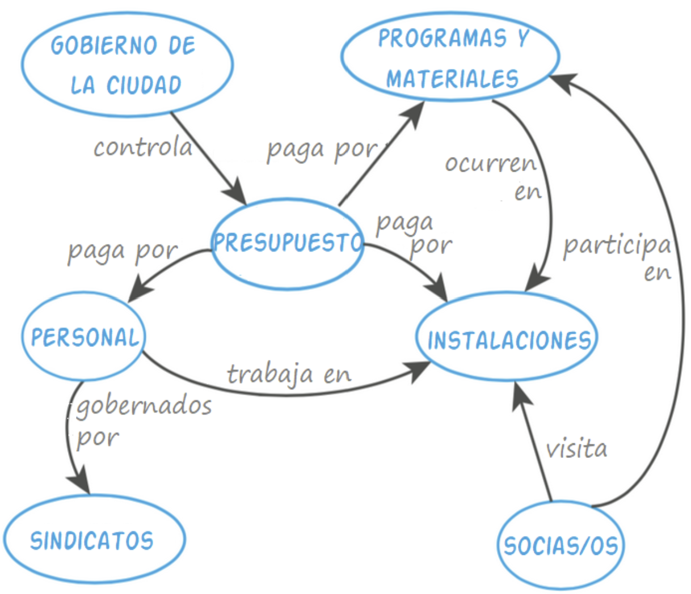
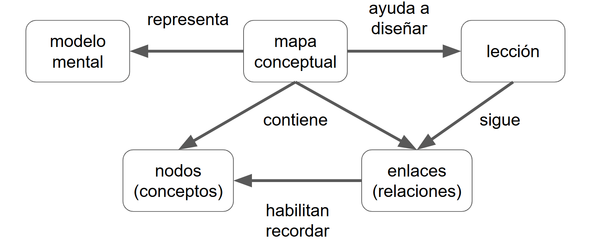
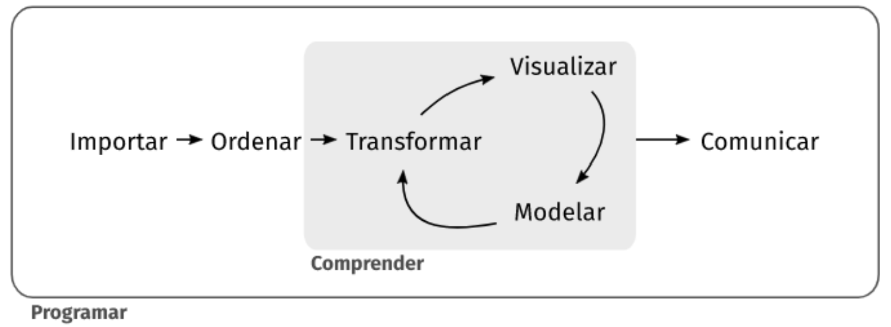
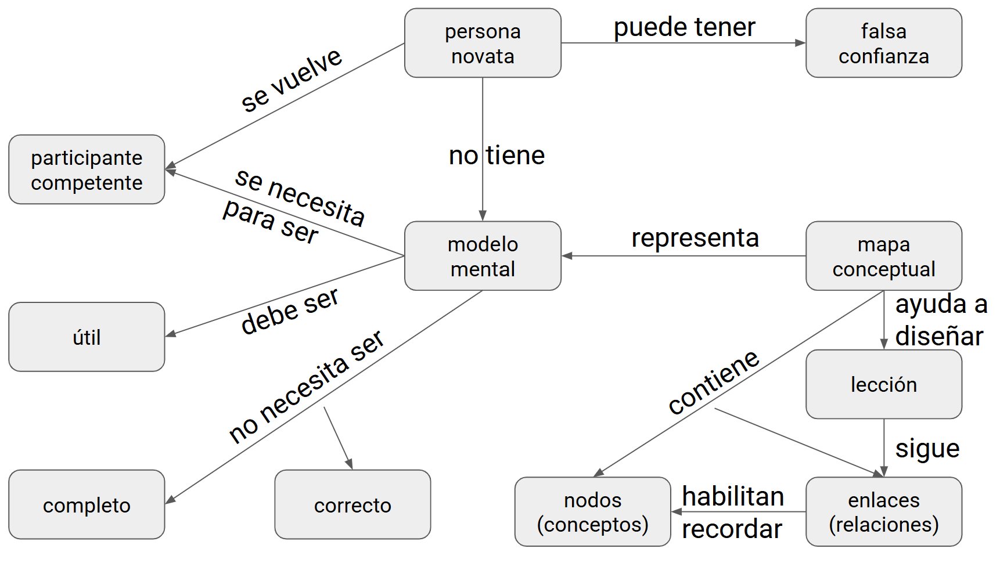

:::::::::::::::::::::::::::::::::::::: questions 

- ¿Cómo aprenden las personas?
- ¿Cómo ayudar a personas novatas?

::::::::::::::::::::::::::::::::::::::::::::::::

::::::::::::::::::::::::::::::::::::: objectives

- Explicar e identificar los modelos mentales de personas novatas, competentes y expertas  
- Demostrar cómo ayudar a construir nuevos modelos mentales
- Comprender la progresión cognitiva para aplicar recursos eficientes en tus lecciones

::::::::::::::::::::::::::::::::::::::::::::::::

## Progresión Cognitiva

A partir de la década de los 80, Patricia Benner comenzó a estudiar la forma en que las personas que practican la enfermería pasan de ser novatas a expertas. Lo que encontró, y lo que se ha replicado al observar otros grupos, es que la mayoría de las personas pasan por una serie bastante predecible de transiciones cognitivas. No solo acumulan más conocimiento: en realidad comienzan a pensar en los problemas de maneras muy diferentes. 

::::::::::::::::::::::::::::::::::::: instructor 

Cuando decimos que la mayoría de las personas, la mayor parte del tiempo, eso se debe a que siempre hay una distribución, pero esta progresión es bastante predecible para la mayoría de las personas adultas neurotípicas.

::::::::::::::::::::::::::::::::::::::::::::::::

Benner identificó cinco etapas:

- Persona novata
- Principiante avanzada
- Competente
- Competente avanzada
- Persona experta

Pero para nuestros propósitos, vamos a simplificar el modelo a tres:

- Persona novata
- ~~Principiante avanzada~~
- Competente
- ~~Competente avanzada~~
- Persona experta

::::::::::::::::::::::::::::::::::::: challenge 

## Ejercicio: ¿Cuáles son los síntomas de que una persona es novata?

Tómense un par de minutos y escriban en el documento compartido algunos síntomas de que alguien es una persona novata. No se preocupen aún por el "por qué"; en cambio, enumeren las cosas que hacen o dicen que les llevan a clasificarlas como un cocinero novato, un conductor novato, una oradora novata del esperanto o una programadora novata.

::::::::::::::::::::::::::::::::::::::::::::::::

## Personas novatas

Aquí hay algunas respuestas comunes a la pregunta: 

> ¿Cuáles son los síntomas de que una persona es novata?

- Hacen las cosas de memoria
- Hacen preguntas sin sentido
- Usan términos incorrectos
- No diferencian qué es relevante
- Les falta confianza

Antes de explorar lo que tienen en común, necesitamos eliminar una.

- Hacen las cosas de memoria
- Hacen preguntas sin sentido
- Usan términos incorrectos
- No diferencian qué es relevante
- ~~Les falta confianza~~

Algunos de los síntomas de ser una persona novata son que haces las cosas de memoria: tienes una receta que sigues pero no entiendes el por qué esos pasos, por qué están en ese orden o qué hacer si algo sale mal.
 
Los novatos a menudo hacen preguntas sin sentido como "¿De qué color es la base de datos?" 

Un tercer síntoma es que los novatos con frecuencia no pueden decir qué es relevante y qué no lo es; es muy común, por ejemplo, ver a las personas programadoras novatas poner sus propios nombres de variables o nombres de archivos en consultas en un sitio como Stack Overflow. Todavía no tienen una clara distinción en sus cabezas entre lo que pertenece al lenguaje y lo que es específico de su programa. 

Una cosa que no es un síntoma confiable de ser una persona novata es la confianza o la falta de confianza. Esto se debe a algo llamado efecto Dunning-Kruger: cuanto menos sepa sobre un tema, menos precisa será tu estimación de cuánto sabes y cuánto no sabes.

{alt="El gráfico muestra una curva amarilla que representa el efecto Dunning-Kruger: en el eje horizontal se indica el “Conocimiento del área”, de poco a mucho, y en el vertical la “Confianza”, de poca a mucha. La línea empieza en el extremo inferior izquierdo con un punto etiquetado “¿Eh?”, asciende rápidamente hasta un pico llamado “Ya sé todo”, desciende atravesando “Esto es más de lo que pensaba” y toca fondo en “Nunca voy a entender esto”; a partir de allí sube gradualmente pasando por “Empieza a tener sentido” y llega al extremo superior derecho en “Créeme, es complicado”. Cada fase está marcada con un punto rojo que señala cómo la confianza varía a medida que crece el conocimiento."}

::: callout
### Características de una Persona Novata

Lo que hace a alguien una persona novata es que aún no tiene un modelo mental del problema: no sabe cuáles son las piezas importantes o cómo se relacionan. Por lo tanto, tienen que seguir pasos sin comprender por qué, o tomar prestados conceptos de otros dominios que entienden y esperar que las analogías se mantengan.
:::

## Un modelo mental

Aquí hay un ejemplo de lo que queremos decir con un modelo mental. 

> En la clase de ciencias de la escuela secundaria, probablemente les enseñaron que los átomos son bolas de colores brillantes conectadas por resortes. 

Ninguna de esas cosas es realmente cierta, pero es un modelo útil para comprender las cosas que las personas quieren entender en esa etapa de su desarrollo y para resolver los problemas que quieren resolver.

Otro modelo mental puede ser:

> Una computadora tiene una CPU, algo de RAM y un disco duro.

Es realmente útil para explicar el rendimiento de la computadora a principiantes, pero de nuevo, todo esto es falso. Tu computadora probablemente tenga varios procesadores, hay al menos tres niveles de memoria y su disco duro probablemente no sea una única unidad. Sin embargo, nada de eso es importante para la mayoría de quienes programan. El modelo les permite hacer predicciones sobre las que pueden actuar y arreglar las cosas que salen mal.

**Versión actual, orientada a programación**

## Cómo Ayudar Personas Novatas

**Ayúdenlas a construir un modelo mental**

Hasta que alguien tiene un modelo mental, no tiene dónde poner información y no puede decir qué partes son útiles y cuándo son útiles. Por lo tanto, el objetivo al enseñarle a principiantes es ayudarles a construir un modelo mental. 

Por ejemplo, la introducción de Software Carpentry al shell de Unix cubre 15 comandos en 3 horas. Es solo un comando cada 12 minutos. Esto suena a un ritmo muy lento hasta que te das cuenta de que el objetivo es realmente ayudarlos a comprender:

- ¿Qué es un camino (path)?
- ¿Cuál es la diferencia entre una ruta absoluta y una ruta relativa?
- ¿Qué es un directorio de inicio?
- ¿Qué son las flags de un comando?
- ¿Qué es un pipe?
- ¿Qué es el historial y cómo se usa?
- ¿Qué es un comodín?

Hasta que tu audiencia sepa esto, nada más tendrá sentido.

**Propuesta**

## Cómo Ayudar Personas Novatas

**Ayúdenlas a construir un modelo mental**

Hasta que alguien tiene un modelo mental, no tiene dónde poner información y no puede decir qué partes son útiles y cuándo son útiles. Por lo tanto, el objetivo al enseñarle a principiantes es ayudarles a construir un modelo mental. 

Por ejemplo, si enseñamos a armar una huerta, no se trata solo de decir “plantá esto acá”. Necesitamos que quienes aprenden comprendan:

- Qué necesita una planta para crecer: luz, agua, tierra y tiempo.
- Cuáles son las estaciones más adecuadas para cada cultivo.
- Qué diferencia hay entre sembrar en almácigo y en tierra directa.
- Qué tipo de suelo conviene usar y cómo prepararlo.
- Cómo se asocian algunas plantas entre sí y cuáles es mejor mantener separadas.
- Cómo se reconocen las plagas más comunes y qué hacer sin dañar la huerta.

Sin estas nociones básicas, la experiencia puede volverse frustrante. Pero con un modelo mental claro, cuidar una huerta se vuelve una tarea más comprensible, placentera y posible de sostener en el tiempo.

::: callout
## Cómo saber que fue un trabajo exitoso

Pueden saber cuándo las personas tienen un modelo mental utilizable cuando pueden leer el manual o, en estos días, cuando pueden escribir la búsqueda correcta en su navegador y reconocer una respuesta útil cuando aparece.
:::

## Mapas mentales

Entonces, ¿cómo hacemos esto? El primer paso para cualquier lección es descubrir qué modelo mental quieres que tengan, y la mejor manera de hacerlo es dibujar un mapa conceptual.

Por ejemplo, podemos analizar el mapa mental de una usuaria de una biblioteca (según lo dibujado por Amy Hodge de la Universidad de Stanford).

{alt="Mapa conceptual de una biblioteca que muestra cinco nodos (“Edificio o sucursal”, “Libros y materiales”, “Personal”, “Socia/o” y “Taller de cuentos”) conectados con flechas rotuladas que describen sus relaciones: el edificio está ‘lleno con’ libros; el personal ‘compra’ libros, ‘ayuda a encontrar’ materiales a las socias/os y les ‘evalúa multas’; las socias/os ‘buscan’ libros, ‘preguntan’ al personal y ‘llevan a las/os niñas/os’ al taller, que a su vez se ‘realiza en’ el edificio."}

Y aquí está el modelo mental para la dirección de la biblioteca:

{alt=“Mapa conceptual sobre la dirección de una biblioteca: el Gobierno de la ciudad controla y paga por el Presupuesto; este paga por Programas y materiales, Personal e Instalaciones. El personal trabaja en las instalaciones y está gobernado por Sindicatos. Las Socias/os visitan las instalaciones y participan en los programas, que ocurren en dichas instalaciones.”}

Aquí hay un mapa conceptual que muestra nuestro modelo mental de los mapas conceptuales.

{alt=“Diagrama meta-conceptual: un ‘mapa conceptual’ ‘representa’ un ‘modelo mental’, ‘contiene’ ‘nodos (conceptos)’ y ‘enlaces (relaciones)’, los cuales ‘habilitan recordar’. El mapa conceptual también ‘ayuda a diseñar’ una ‘lección’, que a su vez ‘sigue’ los enlaces.”}

Hay muchas formas de dibujar el modelo mental de alguien. Este se parece más a un árbol de decisión...

{alt=“Mapa conceptual que parte del nodo ‘manzana’ con la relación ‘puede ser’ hacia tres colores: ‘roja’, ‘amarilla’ y ‘verde’. De ‘roja’ y ‘amarilla’ sale la relación ‘está’ hacia ‘madura’; de ‘verde’ hacia ‘inmadura’. Otro camino señala que una manzana ‘puede estar’ madura ‘a menos que sea’ ‘Granny Smith’, conectando ese cultivar como excepción.”}

### Alternativas

... y, a veces, un diagrama o Diagrama de Venn es más preciso. Lo que hacen los mapas conceptuales que la mayoría de los otros esquemas no hacen es etiquetar las relaciones. Esos enlaces son cómo pasamos del conocimiento que tenemos al conocimiento que necesitamos. Si no les dicen a sus estudiantes cómo están conectados dos hechos, probablemente no podrán recordarlos.

{alt=“Diagrama de Venn con círculos anidados que aclaran la geografía política de las islas británicas: el contorno mayor es ‘British Isles’; dentro, círculos para ‘United Kingdom’ y ‘Ireland’. En el Reino Unido se incluye ‘Great Britain’, que contiene ‘England’, ‘Scotland’ y ‘Wales’. ‘Northern Ireland’ comparte intersección con Irlanda. Círculos aparte muestran ‘Isle of Man’ y, al sudeste, ‘Channel Islands’ con ‘Guernsey’ y ‘Jersey’.”}

{alt=“Flujo de trabajo de ciencia de datos dentro de un rectángulo grande titulado ‘Programar’. Una banda gris interna llamada ‘Comprender’ encadena las etapas ‘Importar → Ordenar → Transformar’; de Transformar surgen flechas hacia ‘Visualizar’ y ‘Modelar’ que se retroalimentan entre sí, y una flecha de salida apunta a ‘Comunicar’.”}

## Uso en Diseño de Lecciones

Dibujar un mapa conceptual antes de comenzar a escribir una lección ayuda a *definir los objetivos* de la lección. También ayuda a *concentrarse en el contenido antes de preocuparse por el orden*, y nos recuerda *enfatizar las relaciones* entre las cosas además de las cosas en sí mismas. Finalmente, es una *buena manera de comunicarse con sus pares*: lo más probable es que si enseñan con alguien que tiene modelos mentales muy diferentes a los de ustedes para un tema, les resultará difícil enseñarlo conjuntamente. 

Más adelante veremos cómo usar mapas conceptuales al enseñar o evaluar una lección.

::::::::::::::::::::::::::::::::::::: challenge 

## Ejercicio: Mapa mental

En grupos, dibujen un mapa conceptual de algo que puedan explicar en 2 minutos. Por ejemplo:
- Hacer pan
- Datos tabulares
- Sumar 2+2

Cuando hayan terminado, cárguenlo al documento compartido.
::::::::::::::::::::::::::::::::::::::::::::::::

:::::::::::::::::::::::::::::::::::::::::::::::::::::::::::::::::::: instructor

###Pausa

No se desconecten, pero sí aléjense de pantallas.

Volvemos en 10 minutos

::::::::::::::::::::::::::::::::::::::::::::::::::::::::::::::::::::::::::::::::

Aquí hay un posible mapa conceptual para la fotosíntesis. El de ustedes podría ser muy diferente: podrían enfatizar diferentes elementos o estar pensando en ello desde el punto de vista de una audiencia diferente. Lo que esto hace es externalizar el proceso cognitivo: deja al descubierto el pensamiento de ustedes donde otras personas (y ustedes) pueden verlo.

{alt=“Mapa conceptual de síntesis sobre modelos mentales: una ‘persona novata’ no tiene ‘modelo mental’, puede tener ‘falsa confianza’ y se vuelve ‘participante competente’ cuando desarrolla uno. El ‘modelo mental’ representa un ‘mapa conceptual’, que contiene ‘nodos (conceptos)’ y ‘enlaces (relaciones)’ que habilitan recordar y ayuda a diseñar una ‘lección’ que sigue esos enlaces. Para que sea útil, el modelo mental debe ser ‘útil’ pero no necesita ser completamente ‘correcto’ ni ‘completo’; además, se necesita para ser un participante competente.”}

## Resumen Hasta Aquí

Este mapa conceptual resume todo lo visto hasta aquí. El mapa conceptual presenta los conceptos y relaciones principales entre los conceptos pertinentes a los modelos mentales. 

Los modelos mentales deben ser útiles y no necesitan ser completos o correctos. Cuando una persona novata (que puede tener una falsa confianza) desarrolla un modelo mental, se convierte en un/una practicante competente. 

Los mapas conceptuales se usan para representar un modelo mental por medio de nodos que representan conceptos y enlaces que representan relaciones. Las relaciones habilitan a recordar los conceptos. Estos mapas también ayudan a diseñar una lección siguiendo las relaciones.

{alt=“Flujo de trabajo de ciencia de datos dentro de un rectángulo grande titulado ‘Programar’. Una banda gris interna llamada ‘Comprender’ encadena las etapas ‘Importar → Ordenar → Transformar’; de Transformar surgen flechas hacia ‘Visualizar’ y ‘Modelar’ que se retroalimentan entre sí, y una flecha de salida apunta a ‘Comunicar’.”}

## Progresión Cognitiva

Los mapas conceptuales también ayudan a explicar las diferencias entre los mapas mentales de las personas novatas, competentes y expertas. Por supuesto que nuestro cerebro no se parece en nada a conceptos conectados en un grafo, pero este esquema nos va a ayudar a describir visualmente los distintos niveles de conocimiento de un tema. 

Las personas novatas no tienen muchas conexiones entre conceptos.

{alt=“Red fragmentada de hexágonos: A conecta solo con C; B y D están aislados sin conexiones; E se enlaza únicamente con F, y F solo con E. Existen escasos vínculos y la mayoría de los nodos quedan separados unos de otros.”}

Las personas competentes tienen más conceptos y más conexiones entre los conceptos, pero pueden tomar varios pasos para pasar de lo que saben a lo que necesitan resolver.

{alt=“Red de hexágonos con conexiones selectivas: A se enlaza con B mediante una arista; B se une a C, que a su vez conecta con D. El nodo D enlaza con C, E y J; E conecta con D y F; F se une a E y a J; J enlaza con D y con Q. Los grupos están relacionados por algunos puentes, pero la red no es completamente densa.”}

Las personas expertas tienen muchas más conexiones, por lo que su camino es más corto, de hecho, tan corto que a menudo pueden saltar de principio a fin en un solo paso. Las personas expertas pueden no tener más conceptos que una persona competente; la diferencia importante es la cantidad de conexiones.  

:::::::::::::::::::::::::::::::::::::::::::::::::::::::::::::::::::: instructor

Pregunta para responder en el chat: ¿alguna vez vieron a una persona experta mirar un problema y decir “¡es obvio!”? Por ejemplo, una radióloga experta que mira una radiografía y dice: “El pulmón está afectado”. Llegan a eso de un solo paso. Hacen lo mismo que hacemos quienes no estudiamos radiología para reconocer caras. Las personas hacen coincidir patrones, no podemos explicar cómo obtuvimos la respuesta.

::::::::::::::::::::::::::::::::::::::::::::::::::::::::::::::::::::::::::::::::

Esto también lleva al punto ciego de la persona experta: no puede explicar su razonamiento porque no hay razonamiento.

{alt=“Diagrama en forma de colmena que muestra seis hexágonos etiquetados A – F densamente interconectados dentro de un contorno envolvente. El hexágono C ocupa el centro y se conecta con todos los demás; A y B están arriba unidos entre sí y con C; D y E aparecen a los costados conectados entre sí, con C y con F; F se ubica abajo y enlaza con C, D y E. El resultado es una malla cerrada con múltiples caminos redundantes.”}

## No Eres Tus Estudiantes

### Punto ciego de la persona experta

Esta es una de las 10 pautas de Greg Wilson que nos gusta retomar en MetaDocencia: "No eres tus estudiantes". 

Así que mucha atención al punto ciego de la persona experta. Este punto ciego, es decir, saber la respuesta a un problema pero no saber cómo se llegó a ella, es uno de los motivos por los cuales no siempre una persona experta es la mejor para enseñar un tema. Las personas expertas se pueden reentrenar para ver el mundo como una persona novata, pero esto toma trabajo. Las personas competentes tienen mucho más fresco en la memoria cómo es entrar a un tema por primera vez.

### Cuiden la forma en que hablan y el humor

Otra de las cuestiones que hay que considerar es la forma en que hablamos y el humor que usamos. Tanto la forma de comunicarse como el humor como la inclusión de memes y chistes, hacen al aspecto social de la enseñanza y sus usos penden de un fino equilibrio. La inclusión de un lenguaje acorde al público y de humor acorde a sus asistentes suma mucho desde lo social y puede motivar y ayudar a aprender. Sin embargo, hay palabras o formas de hablar que matan la motivación. 

::::::::::::::::::::::::::::::::::::: challenge 

## Ejercicio: Pregunta para Contestar en el Chat

Tipeen en el chat:
1. Frase corta/palabra que puede tener un efecto desmotivador
2. Frase corta/palabra que podría reemplazarla

::::::::::::::::::::::::::::::::::::::::::::::::

## Estudiantes de distintos niveles

Una consulta frecuente de este curso, una vez que charlamos sobre los distintos niveles de progresión cognitiva, es cómo diseñar una clase cuando sus estudiantes tienen distintos niveles. 

El primer consejo sobre este tema es tratar de evitarlo, ya que todas las propuestas que siguen requieren trabajo adicional.

Si no se puede evitar, se podría diseñar una clase contemplando enseñanza para distintos grupos según su nivel. 

Otra opción es identificar a las personas más avanzadas y que estas personas ayuden a sus colegas. 

Otra opción es la instrucción por pares en pequeños grupos, armando los grupos de manera tal que se mezclen los niveles. Finalmente, se puede hacer una propuesta de reunirse a estudiar permitiendo que cada estudiante trabaje a su propio ritmo en forma individual. Esta opción requerirá propuestas de trabajo diferentes para los distintos niveles y un enfoque activo. En una clase de programación, podría ser la resolución de ejercicios en el aula de distintos niveles y que el personal docente a cargo esté disponible para consultas.

::::::::::::::::::::::::::::::::::::: keypoints 

- Nuestro objetivo al enseñar a personas novatas es ayudarlas a construir modelos mentales útiles.
- Explorar nuestros propios modelos mentales puede ayudarnos a prepararnos para transmitirlos.
- Las personas novatas no tienen muchas conexiones entre conceptos.
- Las personas competentes tienen más conceptos y más conexiones entre los conceptos, pero pueden tomar varios pasos para pasar de lo que saben a lo que necesitan resolver.
- Las personas expertas pueden no tener más conceptos que una persona competente, la diferencia importante es la cantidad de conexiones.

::::::::::::::::::::::::::::::::::::::::::::::::
