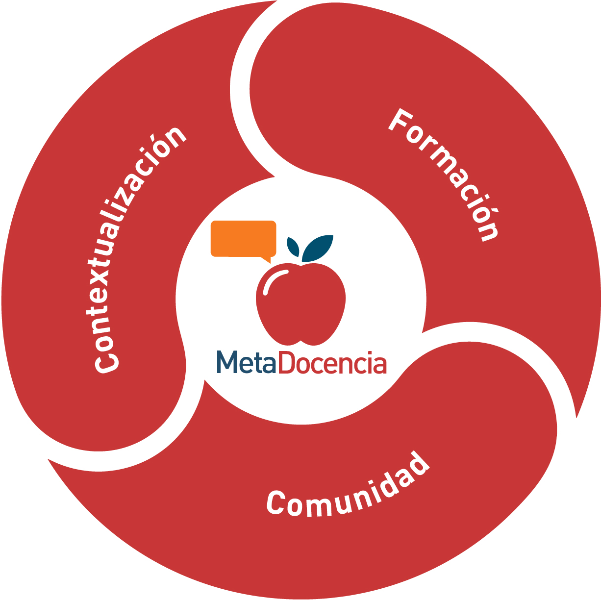

# Entrenamiento docente

Les damos la bienvenida al entrenamiento docente de MetaDocencia, una adaptación del curso «Train the Trainers» de The Carpentries.

Revisaremos elementos clave para el éxito de un curso practicando la retroalimentación constructiva que enriquece el proceso formativo. Quienes participen adquirirán conocimientos, habilidades y orientaciones prácticas para diseñar y facilitar instancias de formación con un enfoque en el aprendizaje activo. 

## Cuál va a ser el recorrido

- **Introducción:** Para entender un poco más sobre el curso y sus objetivos. Explica la importancia de diseñar clases basadas en evidencia y muestra cómo las personas tipo guían todo el proceso de enseñanza. 
- **Modelos mentales:** Describe la progresión de los modelos mentales de personas novatas, competentes y expertas y cómo ayudar a las personas principiantes a crear modelos mentales útiles.
- **Carga cognitiva:** Explica la arquitectura cognitiva básica y estrategias para gestionarla. 
- **Capacidad:** Analiza la memoria en el aprendizaje y técnicas de enseñanza para el desarrollo de contenidos efectivos
- **Evaluación:** Introduce la evaluación formativa para diagnosticar conceptos erróneos, la instrucción entre pares y el diseño inverso de lecciones
- **Crítica:** Aborda cómo recibir y dar crítica constructiva para mejorar continuamente la enseñanza. 
- **Motivación:** Contrasta motivación intrínseca y extrínseca, destaca factores que la fomentan y desfavorecen.
- **Aprendizaje:** Demuestra por qué el aprendizaje activo supera al pasivo y presenta estrategias para potenciar la retención. 
- **Preparación:** Propone la preparación antes de comenzar una clase.
- **Final:** Recapitula el contenido del curso, explica cómo crear tu propia lección reproducible a partir del Workbench adaptado por MetaDocencia y propone los siguientes pasos.

## Nos presentamos

### MetaDocencia

MetaDocencia es una organización sin fines de lucro donde trabajamos para que la producción, la comunicación y la aplicación de saberes científicos y técnicos sean globalmente equitativos.

Construimos capacidades científicas y técnicas en forma responsable y con mirada local, a través de la co-creación de redes, espacios de aprendizaje y recursos accesibles para comunidades hispanohablantes.

Trabajamos desde América Latina consolidando a la región en el mapa global de la investigación. Nos proponemos facilitar la conexión de profesionales en ciencia y técnica, promoviendo el intercambio de conocimientos y la colaboración. 

#### Nuestros pilares de trabajo

Llevamos adelante nuestra propuesta a partir de una serie de proyectos que se enmarcan en tres pilares de trabajo que están interconectados y forman un círculo virtuoso: Contextualización, Formación y Comunidad.

- **Contextualización:** Adaptamos materiales, textos y recursos al español y al inglés.
- **Formación:** Enseñamos y aprendemos en forma virtual y presencial. Nuestras clases son activas, con un enfoque pedagógico basado en evidencia.
- **Comunidad:** Conectamos, intercambiamos y aprendemos con otras personas y organizaciones.

Si te interesa saber más sobre nosotros, puedes entrar a [nuestra web](https://www.metadocencia.org). También puedes suscribirte a nuestro [Newsletter](https://www.metadocencia.org/suscripcion/) y recibir todas las novedades.

### Docentes y equipo

- **[Nicolás Palopoli](https://www.metadocencia.org/authors/npalopoli/)** Co-Director Ejecutivo y Chair del Consejo Asesor. Desde 2008 realiza tareas docentes de grado, posgrado y extensión, en modalidad presencial y virtual, tanto en UNQ como en otras instituciones educativas y para comunidades de práctica. Instructor y entrenador de instructores en The Carpentries.

- **[Laura Ación](https://www.metadocencia.org/authors/lacion/)** Co-Directora Ejecutiva. Investigadora adjunta del CONICET en la Universidad de Buenos Aires, donde dirige el Co-Laboratorio de Uso Responsable de Datos. Tiene más de dos décadas de experiencia ofreciendo servicios de consultoría y enseñanza. 
  
- **[Jesica Formoso](https://www.metadocencia.org/authors/jformoso/)** Coordinadora del área de MEdición de Impacto de MetaDocencia. Psicóloga cognitiva de la Universidad de Buenos Aires e investigadora asistente de CONICET. Se dedica a la docencia y la investigación, destacándose como organizadora del capítulo de Buenos Aires de R-Ladies. Instructora certificada de RStudio y The Carpentries.
  
- **[Paz Miguez](https://www.metadocencia.org/authors/pazmiguez/)** Coordinadora de áreas Institucional y Formación. Licenciada en Ciencia Política, con una Maestría en Política Educativa y un Profesorado en Docencia Superior. Más de 15 años de experiencia, en el diseño, gestión y monitoreo de programas educativos.
  
- **[Julián Buede](https://www.metadocencia.org/authors/jbuede/)** Equipo de Comunicación. Se especializa en formatos para contenidos audiovisuales educativos, especialmente en el ámbito de tutoriales y clases asincrónicas, con el objetivo de desarrollar formas creativas de presentar información.
  
- **[Irene Vazano](https://www.metadocencia.org/authors/irenevazano/)** Coordinadora del área de Infraestructura. Licenciada en Bibliotecología en la UCSE-DABA. Con experiencia de trabajo en bibliotecas académicas y como profesional independiente en diversos proyectos digitales, desempeñando roles de administración y garantizando la calidad de accesibilidad.

## Antes de empezar

### Pautas de convivencia

Estas son nuestras [pautas de convivencia](https://doi.org/10.5281/zenodo.12534195). Nos ayudan a fomentar un ambiente abierto, seguro y amigable y garantizar la participación de todas las personas en nuestras actividades y espacios virtuales.

Alentamos a la comunidad a apropiarse y a participar de estas pautas para que representen a todas las personas. Nos comprometemos a construir una
comunidad amigable y respetuosa, y aunque en algunas ocasiones fallaremos, nuestro objetivo es que todas las personas reciban un trato justo, inclusivo y lo más equitativo posible. 

## Código Abierto - Ciencia Abierta - Educación Abierta

Creemos muy firmemente que las personas aprenden mejor cuando aprenden juntas, por eso todos estos materiales están disponibles gratuitamente bajo la licencia Creative Commons - Attribution - ShareAlike license. Te alentamos a que los compartas, adaptes y reuses, siempre que incluyas un enlace a la fuente original y distribuyas tu propio material bajo la misma licencia para ayudar a otras personas.

---

## 📬 Contacto

쯊ienes dudas? Escríbenos a:  
📧 formacion@metadocencia.org

Puedes encontrar más materiales y recursos en:  
🌐 https://www.metadocencia.org

