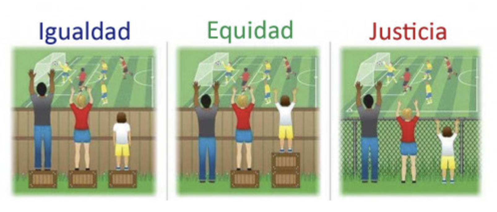
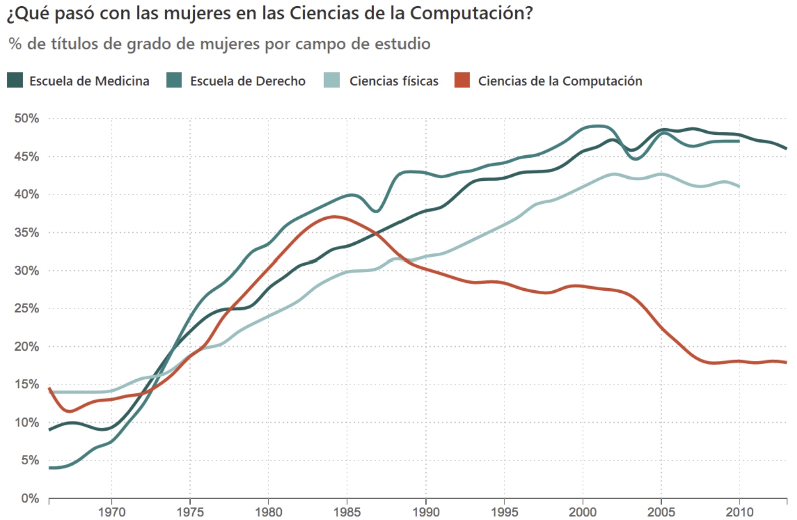
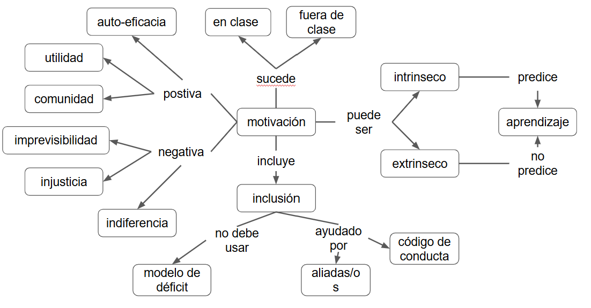

:::::::::::::::::::::::::::::::::::::: questions 

- ¿Qué nos motiva a aprender y a enseñar?

- ¿Qué efecto tiene la motivación en la memoria a largo plazo?

- ¿Cómo crear condiciones que fomenten el interés por aprender?

::::::::::::::::::::::::::::::::::::::::::::::::

::::::::::::::::::::::::::::::::::::: objectives

- Diferenciar entre motivación intrínseca y extrínseca.

- Analizar cómo la motivación incide en la retención y profundidad del aprendizaje.

- Diseñar estrategias que promuevan un compromiso genuino de nuestra audiencia.

::::::::::::::::::::::::::::::::::::::::::::::::

## Motivación

| Motivación   | Descripción                          |
|--------------|--------------------------------------|
| Intrínseca   | Hago esto por mis propios motivos    |
| Extrínseca   | Hago esto porque debo                |

::::::::::::::::::::::::::::::::::::: instructor

¿Alguna vez cursaron una materia, aprobaron el final y se olvidaron de todo? A mí me pasó. 

::::::::::::::::::::::::::::::::::::::::::::::::

El predictor más fuerte de si una persona adulta aprende algo o no es su motivación, y cualquier discusión sobre la motivación tiene que comenzar con la diferencia entre la motivación intrínseca y la motivación extrínseca. 

Aprender a tocar el ukelele porque siempre has querido es intrínseco; aprender porque estás en quinto grado y la profesora lo dijo es extrínseco y es poco probable que retengas lo enseñado. Si la persona no tiene una conexión emocional con lo que quiere aprender, no lo va a hacer. 

### Positiva: Auto-Eficacia

> Controlo mi vida

Primero y más importante, las personas adultas quieren tener el control de sus propias vidas; quieren decidir qué van a hacer, qué van a aprender. La autoeficacia es lo que hace que la capacitación en línea autorregulada, cursos como Coursera o Edx sean tan populares: permite a las personas (bueno, a quienes tienen el privilegio de tener tiempo libre) aprender lo que quieren y cuando quieren. El live coding ayuda a que nuestra audiencia  se sienta más en control sobre lo que está aprendiendo, a diferencia de una presentación como esta donde solo observan. Las evaluaciones formativas también.

### Positiva: Utilidad

> Esto va a ayudarme a alcanzar mis metas

La utilidad es el segundo gran motivador para personas adultas. Consciente o inconscientemente nos preguntamos todo el tiempo: ¿Esto es útil? ¿Me ayudará a cumplir mis objetivos? 

Es importante tener en cuenta que hay muchos tipos de utilidad, así como las personas tienen diferentes tipos de objetivos: aprender el ukelele probablemente no nos ayudará a encontrar un trabajo, pero esa no es la razón por la que lo estamos haciendo. Las tareas auténticas nos ayudan a motivar a partir de la utilidad. 

### Positiva: Comunidad

> Gente que conozco está aprendiendo esto conmigo

El tercer motivador es la comunidad. A las personas les gusta hacer lo que hacen sus amistades, su vecindad y sus colegas, y les gusta hacer cosas juntas; es por eso que el mejor predictor de si alguien realmente va a ir a un gimnasio es si alguien que conocen les acompaña o no. Al mismo tiempo enseñar a un grupo de personas que se conocen y se sienten cómodos y cómodas entre ellas ayuda un montón. Hacen más preguntas y participan más, se sienten en confianza y saben que el resto está en la misma situación.

### Negativa: Imprevisibilidad

> Lo que hago no parece afectar el resultado

Ahora veamos las cosas que desmotivan. Lo más importante es la imprevisibilidad: si algo funciona una parte del tiempo, pero no otras, la gente deja de intentarlo porque no tiene sentido; es frustrante. Si resuelvo dos veces un ejercicio de la misma manera pero la segunda vez desapruebo porque cambiaron las reglas, va a ser muy desmotivante. Esto se llama impotencia aprendida.

### Negativa: Injusticia

> Quien enseña tiene personas favoritas

Un segundo gran desmotivador es la injusticia. Hay estudios que demuestran que si la gente cree que el juego está manipulado, le va a ir peor a todas las personas, incluso a las personas para las cuales el juego está manipulado a su favor. Pero si las reglas son justas y se juega limpio, tiene más sentido el esfuerzo. 

### Negativa: Indiferencia

> A nadie le importa

El tercero de nuestros desmotivadores es la indiferencia, la sensación de que a nadie le importa si tienes éxito o no. Es fácil para tus estudiantes sentirse de esta manera en clases grandes o cuando aprenden en línea, pero también es fácil para quienes enseñan dar esta impresión incluso cuando están enseñando a una sola persona. 

## Los Peligros de la Pre-Evaluación

Es tentador darles a tus estudiantes un cuestionario antes de venir a una clase para descubrir lo que ya saben y dónde debería comenzar la enseñanza. Esto puede salir mal de dos maneras:

1. Puede desmotivar o asustar a las personas a las que se supone que debe ayudar. Sienten que es demasiado difícil, que no tienen el nivel suficiente o que el curso no es para ellos.

2. Puede dar una señal engañosa debido a los falsos principiantes, que realizan las pruebas al mismo nivel que quienes recién comienzan, pero aprenderán más rápidamente debido al conocimiento previo. Los falsos principiantes posiblemente no puedan resolver ejercicios de una pre-evaluación o de la primera clase, pero van a avanzar mucho más rápido hasta llegar a aburrirse. 

::::::::::::::::::::::::::::::::::::: challenge 

## Ejercicio

En el documento compartido: ¿Cómo pueden averiguar qué conceptos erróneos tendrían sus estudiantes acerca de un tema, antes de enseñar sobre ese tema por primera vez, sin perder su motivación?

::::::::::::::::::::::::::::::::::::::::::::::::

## No Sólo en Clase

> Según Kenneth Wesson: Si las niñas y los niños pobres de zonas periféricas superaran sistemáticamente a aquellas y aquellos de hogares suburbanos ricos en pruebas estandarizadas, ¿alguien es tan ingenuo como para creer que aún insistiríamos en usar estas pruebas como indicadores de éxito?

La motivación y la desmotivación no solo ocurren en clase. Como Sahlberg y otros han señalado, una de las razones por las que otros países no han podido replicar el sistema escolar tan exitoso de Finlandia es que no están dispuestos a abordar todos los factores extraescolares que determinan si los estudiantes están dispuestos a y son capaces de tener éxito.

:::::::::::::::::::::::::::::::::::::::::::::::::::::::::::::::::::: instructor

### Pausa

No se desconecten, pero sí aléjense de pantallas.

Volvemos en 10 minutos.

::::::::::::::::::::::::::::::::::::::::::::::::::::::::::::::::::::::::::::::::

::::::::::::::::::::::::::::::::::::: challenge 

## Ejercicio

1. Trabajando en grupos, hagan una breve lista de cosas que pueden suceder en una clase para desmotivar a quienes participan.
2. ¿Qué se puede hacer después de que las cosas salieron mal para recuperarse?

Designar a una persona por grupo para volcar lo conversado en el documento compartido.

::::::::::::::::::::::::::::::::::::::::::::::::

## Accesibilidad

> “No queremos dejar a nadie en el camino, pero el camino lo hacemos nosotros. Está en nosotros hacer ese camino libre de barreras.”  - Iván (equipo de accesibilidad de MetaDocencia)

La accesibilidad ayuda a todas las personas. También ayuda a llegar a la mayor cantidad de personas. Lo mejor es pensar en la accesibilidad desde el inicio. 

## Igualdad - Equidad - Justicia

**Igualdad:** Se les provee a todas las personas el mismo apoyo.
**Equidad:** se le provee a cada persona el poyo que necesita.
**Justicia:** todos acceden sin ningún tipo de apoyo o adaptación porque se removió la causa de la inequidad.  Se eliminó la barrera sistémica.

{alt="Imagen dividida en tres secciones que ilustran los conceptos de Igualdad, Equidad y Justicia a través de una escena en la que tres personas de distinta altura intentan ver un partido de fútbol detrás de una cerca. Igualdad: las tres personas tienen la misma cantidad de cajones (uno cada una), pero solo las más altas pueden ver el partido. La persona más baja no alcanza a ver por encima de la valla. Equidad: los cajones se distribuyen según la necesidad. La persona más alta no usa cajón, la mediana usa uno, y la más baja tiene dos. Todas pueden ver el partido. Justicia: la cerca que impedía la visión ha sido reemplazada por una reja transparente. Todas las personas pueden ver sin necesidad de cajones, porque se ha eliminado la barrera estructural."}

## Inclusión

Ahora tenemos un marco para entender por qué es importante la inclusión en el aula. Este gráfico les puede resultar conocido, muestra cómo la participación de mujeres en la informática ha disminuido desde la década de 1980, incluso mientras aumentaba la participación en otras profesiones y disciplinas científicas, tecnológicas, ingenierías y matemáticas. Las mujeres no decidieron repentinamente en 1984 que no estaban interesadas en ciencias de la computación; en cambio, factores como la comercialización de computadoras como juguetes para niños crearon un círculo vicioso: las mujeres no se sentían bienvenidas, por lo que menos de ellas ingresaron al campo, por lo que las recién llegadas se sintieron aún menos bienvenidas, y así sucesivamente.

{alt="Gráfico de líneas titulado “¿Qué pasó con las mujeres en las Ciencias de la Computación?”. Muestra el porcentaje de títulos de grado otorgados a mujeres entre 1965 y 2010 en cuatro campos de estudio: Escuela de Medicina, Escuela de Derecho, Ciencias físicas y Ciencias de la Computación. Todas las disciplinas muestran un crecimiento sostenido en participación femenina, excepto Ciencias de la Computación, que después de alcanzar un pico cercano al 37% a mediados de los años 80, desciende de manera continua hasta estabilizarse cerca del 18% hacia 2010."}

## No Existe el Gen del Geek

1. Solo el 5,8% de la distribución de calificaciones en 778 cursos de primer año pasa una prueba estadística para más de una moda.
2. Docentes que creen que algunas personas entienden y otras no, tienen más probabilidades de etiquetar las distribuciones ambiguas de "calificación" como bimodales.
3. Las creencias docentes son profecías autocumplidas.

Realizar evaluaciones sin identificar a quién pertenece cada respuesta puede ayudar a reducir desigualdades, como las brechas de género. Cuando quienes enseñan creen, aunque sea de forma inconsciente, que ciertas personas tienen más potencial que otras, tienden a apoyarlas más.

Esto no solo afecta a las mujeres: en distintos contextos, también puede impactar a personas de grupos étnicos subrepresentados o a quienes tienen discapacidades, especialmente visuales, si las herramientas y materiales no están diseñados para ser accesibles.

Como mostraron Patitsas y colegas en 2016, muchas de estas diferencias de trato se explican por sesgos de confirmación: interpretamos la información de forma que refuerce nuestras creencias previas, incluso sin darnos cuenta.

## Lo que pueden hacer

1. No usar un modelo deficitario
2. Ser buen/a aliado/a

Lo más importante es no utilizar un modelo deficitario para pensar en la justicia. No diga que "ellas" tienen que incluirse o que "ellos" necesitan un apoyo especial: eso implica que las personas que son víctimas de la injusticia deben hacer un trabajo extra para superar o eliminar esa injusticia. Este taller del enlace provee muchas formas prácticas de hacer esto. La charla plenaria es un resumen excelente para pensar sobre inclusión.

::::::::::::::::::::::::::::::::::::: challenge 

## Ejercicio

1. En el documento compartido hay un link a una serie de slides. Cada slide corresponde a una sala que se indica en el título.
2. Lean el caso que les tocó y discutan en grupo las preguntas correspondientes.
3. En la slide que está en blanco y tiene el nombre de su sala, hagan un resumen de la discusión.

::::::::::::::::::::::::::::::::::::::::::::::::

## Si Tienes que Echar a Alguien

0. Anuncien el Código de Conducta al comienzo de tus curso
1. Consigan a alguien como testigo
2. Diganle al resto que echaste a la persona problemática
3. Escribanlo
4. Hablen con una persona amiga

¿Alguna vez tuvieron que echar a alguien de sus clases? Muchas veces no estamos preparadas o preparados para hacerlo; lo peor que puede pasar es no actuar cuando era necesario. Es imprescindible conocer si sus instituciones tienen un mecanismo establecido para esto, ¿tiene normas? ¿Tiene Pautas de Convivencia? ¿Y si no, puedo imponer el uso de uno en mi clase? 

Al mismo tiempo es necesario que todas las personas conozcan esas normas y las acepten. Esto ya minimiza la probabilidad de que alguien no se comporte o tenga una actividad intolerante hacia otra persona. 

Si tienen que echar a alguien de sus clases, sigan estos pasos (el paso 0 sucede al comienzo de la clase de manera tal que nadie pueda decir “Pero yo no sabía”)

::::::::::::::::::::::::::::::::::::: challenge 

## Ejercicio

Comenten en grupos sobre alguna vez en que hayan visto a un/a instructor/a actuar para que alguien se sienta incluido/a o valorado/a en clase.

::::::::::::::::::::::::::::::::::::::::::::::::

{alt="Diagrama conceptual sobre la motivación en contextos de aprendizaje. En el centro se encuentra el nodo “motivación”, que puede ser intrínseca (predice el aprendizaje) o extrínseca (no lo predice). La motivación ocurre tanto en clase como fuera de clase, e incluye la inclusión. La motivación positiva se relaciona con autoeficacia, utilidad y comunidad. La motivación negativa se vincula con imprevisibilidad, injusticia e indiferencia. La inclusión no debe basarse en el modelo de déficit, y debe estar apoyada por aliadas/os y un código de conducta. Este esquema muestra cómo distintos factores afectan la motivación, sus efectos en el aprendizaje y la importancia de una inclusión sostenida."}

::::::::::::::::::::::::::::::::::::: keypoints 

- 

::::::::::::::::::::::::::::::::::::::::::::::::
